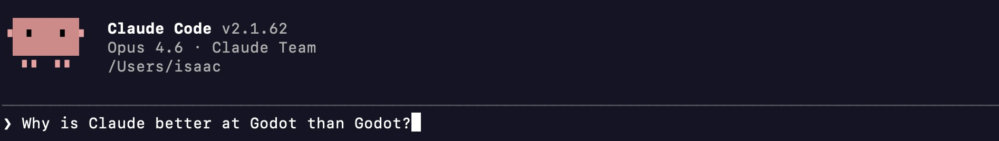
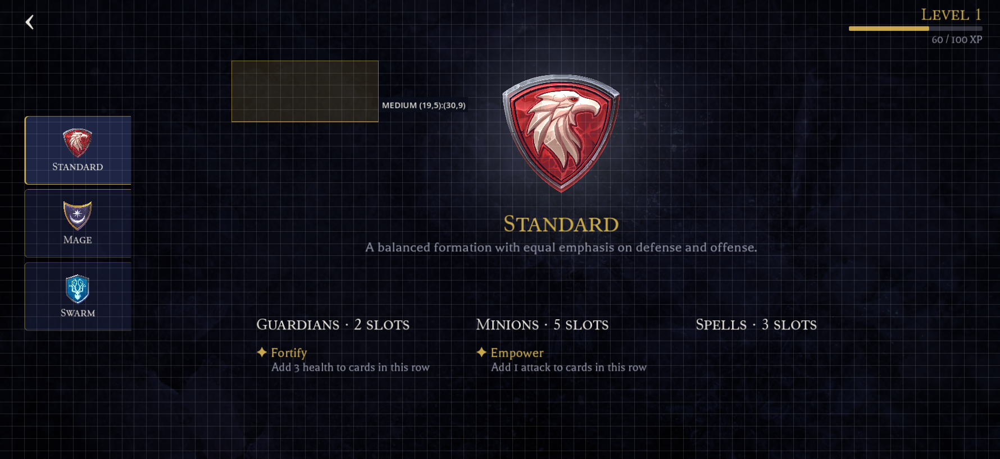
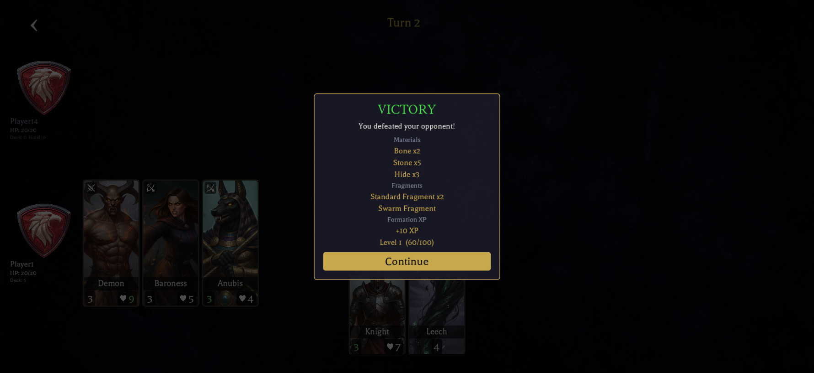

## I've never opened the editor

I'm building a card game in Godot. It has a deck builder with drag-and-drop, a battle arena, crafting screens, shaders I _never_ could have written by hand. And I've managed to get to this point having never opened the Godot editor.

Actually, I lie. I opened it once. My Unity-wired brain didn't like what I saw, so I closed it&mdash;but that didn't stop me from building my front-end using Godot.

The entire UI has been built through Claude Code: editing scene files and scripts in the terminal, verifying changes through a composable test runner, and iterating with a live command queue that talks to the running game.

The game actually started in Unity, and the friction there was what pushed me to try something different. Unity's editor is resource-heavy and needs to be running for most workflows. Every time I tabbed back into it, the domain reload would kick in. Already annoying on its own, but _constant_ when you're bouncing between an AI assistant and the editor. I kept interrupting my own flow just by interacting with it. Getting the MCP server set up was yet another step I had to get through before Claude could even talk to the engine.

Godot offered a simpler, more AI-friendly alternative. Text-based scene files, a lightweight runtime, and no editor dependency meant I could skip the GUI entirely and let Claude do the editing.

It helps that the game is server-authoritative, so the client is purely a presentation layer. There's no sensitive logic or secrets to worry about on the UI side, which makes it easy to give Claude a long leash.



## Why Godot is AI-friendly

Godot is [CLI-friendly](https://docs.godotengine.org/en/latest/tutorials/editor/command_line_tutorial.html), and that's what makes it AI-friendly. The engine runs the game directly from the command line. A single `godot --path <project> --main-scene <scene>` launches the game windowed, ready to interact with. No editor process running in the background, no waiting for it to load. In Unity, you _can't_ run the game without loading the editor first. When your workflow is entirely terminal-based, that made things... not nice.

The file formats help too. `.tscn` scene files are text-based and surprisingly readable. Even having never seen one before, I could follow what was going on:

```ini {linenos=false}
[node name="StartButton" type="Button" parent="MainMenu/VBox"]
layout_mode = 2
size_flags_horizontal = 4
disabled = true
text = "Start Game"
```

GDScript is the same story. Clean, Python-like, easy to pick up. Nothing about the toolchain demands a GUI to work with it.

## The test runner

Being able to edit scenes as text is only half the story. The other half is knowing whether your changes _actually work_. Godot's runtime errors only surface when you navigate to the affected scene, so a broken crafting screen won't tell you anything until you click through to it.

What I wanted was something like end-to-end testing with Playwright: the ability to programmatically navigate through the application, interact with elements, and verify that things work. What I ended up with was a step-based test runner, where each step is a standalone GDScript file with a simple contract:



```gdscript {linenos=false}
extends RefCounted

func run(ctx: TestContext, args: Dictionary) -> String:
    # return "" for pass, error message for fail
    ctx.press_button("CraftingButton")
    await ctx.wait_for_node("CraftingScreen")
    return ""
```

Steps compose into chains via the CLI:

```bash {linenos=false}
godot --path src/client/godot \
  --main-scene res://tests/runner.tscn \
  -- --steps=auth,crafting,select --stay-open
```

A JSON manifest maps aliases to step scripts and defines macros, so `setup:deck` expands to `auth, deck, set_formation, fill_deck, save_deck`. Common sequences get a short name, and you can mix and match freely.

### Dual-speed steps

Not every test needs to drive the real UI. Setting up a full deck through drag-and-drop takes 10&ndash;15 seconds; doing it through API shortcuts takes about 2. So there are two flavours of most steps:

- **`fast_*` steps**&mdash;API shortcuts that set up state directly, skipping the UI
- **`ui_*` steps**&mdash;real clicks and drags, simulating actual player input

The manifest descriptions and macro naming make the intent clear enough that Claude tends to pick the right variant from context. If I ask it to verify a UI flow, it reaches for `ui_fill_deck`. If the deck is just setup for testing something else, it uses `fast_fill_deck`. The macros reflect this too: `setup:deck` uses API shortcuts, `test:battle_e2e` drives the full UI.

### Output

Output goes to both JSONL (for Claude to parse) and Markdown (for human review), with timestamped screenshots at each step. Importantly, Claude _reads_ the trace output and examines those screenshots to diagnose failures. It's not just running the tests, it's analysing the results.

```text {linenos=false}
[1/4] wait_for_auth
  PASS (3402ms)  📸 000_wait_for_auth.png
[2/4] navigate_to
  PASS (160ms)   📸 001_navigate_to.png
[3/4] select_card
  PASS (4ms)     📸 002_select_card.png
[4/4] assert_label
  PASS (0ms)     📸 003_assert_label.png

═══════════════════════════════════════
 4 PASSED, 0 FAILED (7s)
 Traces: .test-traces/2026-03-04_15-52-16/
 Screenshots: .test-traces/2026-03-04_15-52-16/screenshots/
═══════════════════════════════════════
```

## A grid overlay&mdash;talking about pixels

Here's a problem that doesn't really come up in traditional development: how do you tell an AI where things are on screen?

Early on, this was genuinely frustrating. I'd say "nudge that panel a bit to the left", then "no, a bit more to the right", then "make it a little bigger"&mdash;and never _quite_ land on what I actually wanted. "Set the anchor to 0.3" is more precise, but that requires you to already know the current value and do the spatial maths yourself. What I needed was a shared coordinate system&mdash;a way for both me and Claude to point at the same spot on screen and agree on what we're talking about.

The solution was a dev-only grid overlay that draws coordinates over the running game. The backtick key cycles through four modes: OFF &rarr; LARGE (64px) &rarr; MEDIUM (32px) &rarr; SMALL (16px) &rarr; OFF.

When the grid is active, it becomes a measurement tool:

- **Hover** shows a coordinate tooltip (e.g. `MEDIUM (12, 5)`)
- **Click** copies a single cell reference to the clipboard
- **Drag** copies a range (e.g. `MEDIUM (2,7):(79,35)`)

The grid consumes all mouse input when visible. Intentionally so&mdash;it's a measurement mode, not a passive overlay.



### Spatial communication

Instead of vague descriptions, I can now tell Claude exactly what I want:


Reposition the board area to MEDIUM (2,7):(79,35)


Claude knows precisely what region of the screen I'm talking about, and can translate that grid reference into the right anchor and margin values in the `.tscn` file. No guessing, no "a bit more to the left" back-and-forth.

Honestly, this turned out to be the piece that made CLI-driven layout work _genuinely_ viable. Without a shared spatial language, I'd have been constantly fighting imprecise descriptions. With the grid, positioning conversations became as concrete as code reviews.

## The edit-test-verify loop

With all of the above in place, the workflow becomes a pretty tight loop:

1. **Edit**&mdash;Claude modifies a `.tscn` or `.gd` file
2. **Run**&mdash;launch the test runner with the relevant steps
3. **Analyse**&mdash;Claude reads the trace output and examines the screenshots to check whether the change achieved what was asked for
4. **Fix**&mdash;adjust based on what it sees
5. **Re-run**&mdash;verify the fix

The screenshot analysis is what makes this self-correcting. Claude isn't just checking pass/fail. It's _looking_ at the rendered UI and comparing it against the intent. If a panel is misaligned or a label is truncated, it can see that and iterate without me having to point it out.

A single `/client` skill handles both launching and testing. `/client arena` launches the game navigated to the arena screen for me to poke around. `/client verify crafting works` triggers the test runner instead, composing steps, running them, and reporting the trace. Same skill, different mode based on intent.

Because the skill maps natural language to step chains, I can also just describe what I want in plain English:


Launch the game as a new user. Redeem the code "MATERIALS". Craft one copy each of a few different cards. Navigate to the deck editor, and fill the deck up with those cards, then go to the arena and battle one of the opponents.



Claude reads the manifest, maps that description to the available steps, and composes the chain. In practice, a chain this long doesn't always execute cleanly end-to-end, but portions of it do, and those are what end up getting used in verification loops. Being able to just _describe_ what I want rather than spelling out step names takes a lot of friction out of the process.

Once Claude is satisfied that the changes are working, it'll often relaunch the client with `--stay-open` so I can have a look myself. It handles the automated loop, then hands it back to me for a final check.

## Live reload

The test runner is great for verification, but for small tweaks like nudging element positions and adjusting margins, relaunching the client every time gets old fast. This was actually the one point where I was genuinely tempted to just open the Godot editor. Hot reload removed that temptation: make a change, see it immediately in the running game.

A `LiveReload` autoload handles this. It polls for a `.reload` sentinel file, and when it detects a change, it reloads the current scene's script and resources from disk and swaps them in. Touch the file, the scene updates in place.

Right now the touch is manual, but Claude Code's [hooks](https://docs.anthropic.com/en/docs/claude-code/hooks) feature could automate this with a `PostToolUse` hook that fires on every `Edit` or `Write` tool call, making it fully automatic.

## The live command queue

Sometimes I want the game running interactively, but I don't want to click through everything myself. If I'm testing different formations against different opponents, it gets tedious: switch formation, fill the deck, save, navigate to the arena, pick an opponent, fight. I just wanted to tell Claude "switch to mage, fill the deck, and go fight that opponent again" while the game was already running.

### How it works

The mechanism is just two files.

- **`.cmd-queue`**&mdash;written by Claude, contains the step string to execute
- **`.cmd-result`**&mdash;written by the game after execution, contains the results

When the `/client` skill detects a running session, it writes directly to `.cmd-queue` instead of launching a new instance. A `CommandWatcher` autoload in the game polls for that file every 300ms:

1. Claude writes `navigate:deck,picker` to `.cmd-queue`
2. CommandWatcher picks it up and deletes the file
3. Steps execute via the shared `StepRunner` class
4. Results (with screenshots and trace paths) get written to `.cmd-result`
5. Claude reads the result and deletes the file

I went with files over sockets or HTTP because there's just less to think about. No ports, no networking code. Godot's `FileAccess` handles the read/write, and if something goes wrong I can just `cat .cmd-result` to see what happened.

## Case study: Formation unlocks and upgrades

One session that stood out was implementing part of the economy system: formation fragments, XP, levelling, and a battle reward screen. It touched 33 files across 6 projects: domain entities, database migrations, API endpoints, and the Godot client UI.

The implementation used parallel background agents, each given front-loaded context and conventions from `.claude/rules/` files. At peak, five agents were writing code simultaneously.

After the code was written, Claude kicked off the deployment and verification through four skills:

1. **`/migrate apply`**&mdash;built the database migrator, ran it through Aspire, confirmed the new tables and columns were created
2. **`/server restart`**&mdash;restarted the API, verified it came up healthy with the new endpoints
3. **`/client verify battle results`**&mdash;ran the test steps (setup deck, navigate arena, fight battle, assert results), then read the trace screenshots to verify the result

On that verify step, 8 of 9 steps passed. The one failure was a redemption code that had already been used. Not a bug, just existing game state. Claude recognised this as expected rather than flagging it as an issue, and from the final screenshot confirmed three reward sections were rendering correctly: materials, fragments, and formation XP with a progress bar.

4. **`/client new profile`**&mdash;launched with a fresh device ID to verify the feature from a brand new player's perspective. Only the Standard formation owned, Mage and Swarm locked at 0 fragments, and it left the client running for me to explore.

That last one was interesting. Verifying with a fresh player is the kind of thing that usually requires someone to think "what about the new user path?" and go write a separate test for it.

None of these skills were designed as a pipeline. They were built independently, for different purposes, at different times. But they composed naturally because each one is self-contained and they communicate through system state. `/migrate` writes to the database, `/server` picks up new code, `/client` hits the running API.



## Wrapping up

Beyond the iteration speed, this workflow expanded what I could do within a game engine. I've never written a shader, but through this setup Claude wrote frosted glass blurs, Voronoi shard patterns, glow pulses, and vignette effects that I could iterate on and refine just like any other UI element. That was never in my skillset&mdash;the feedback loop made it accessible.

The pattern here isn't specific to Godot or game development, either. A composable step runner, a way to send commands to a running application, and a verification loop that analyses screenshots. I'd be curious to see how well this translates to web development with Playwright or similar tooling.

The picture I keep coming back to is a demo. A stakeholder asks "what happens if X?" and instead of manually clicking through screens trying to get the data into the right state just to hit the right button, I type that scenario into Claude and it executes right there. The stakeholder cares about the result, not the setup. And the tooling that made that demo possible doesn't go away afterwards&mdash;it's the same tooling that drives the verification loop day-to-day.
