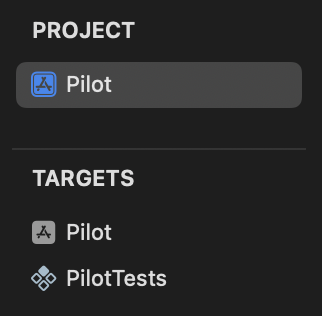
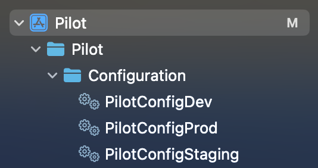

Alrighty. Staring down the barrel of some upcoming work with iOS, and I needed to re-familiarise myself with all things iOS and SwiftUI.

With some previous, very light experience with iOS development, I was reasonably comfortable with my ability to create working functionality within an app. Not a whole lot different to the typical work I would be doing for a web app. Make UI do a thing, wire it up to a backend, and voila.

However, this time I was going to need to get it _out there_. Or, at least as far as TestFlight. I realised I had no idea how to build the "bread" of an iOS-flavoured sandwich; all I knew was the middle.

## The checklist

Now, I should mention before I begin that this post was mostly written as a rant over the convoluted process of learning how to get an iOS app onto TestFlight. That said, I still wanted to leave behind a bit of a guide or checklist that I could refer to in the future. This is that checklist.


**Project setup**

- `Project` in sidebar > `Project` > `Info` > `Configurations`
  - Add entries for each environment, with both a **Release** and **Debug** version
  - Create an `*.xcconfig` for each environment and link them under this section
- `Project` in sidebar > `Target` > `Build Settings`
  - Under `Packaging`, set Bundle IDs for each environment (same values for **Release** and **Dev**)
  - Under `Bundle Display Name`, set Bundle Display Name for each environment (same values for **Release** and **Dev**)
- `Scheme` (dropdown at top of page) > `Manage Schemes`
  - Modify the list to reflect the environments
  - Edit each scheme to ensure the correct **Build Configurations** are set

**App registration**

- Register app
  - Under `Identifiers`, register an App ID for each environment using **Explicit** Bundle ID &mdash; these should match what we used for the Bundle IDs in our project setup
  - In [App Store Connect](https://appstoreconnect.apple.com/apps), add a new app for each environment using those Bundle IDs
- Certificate
  - Create a certificate signing request, using Keychain will be easiest
  - Create an **Apple Distribution** certificate via [Apple Developer Resources](https://developer.apple.com/account/resources/)
- Provisioning profiles
  - Under `Profiles`, create **App Store Connect** provisioning profiles for each environment using the distribution certificate
  - Download the provisioning profiles, install locally, assign to each environment under `Targets` > `Signing & Capabilities` (uncheck **Automatically manage signing** from each environment to manually manage provisioning profiles)

**App Store Connect API**

- [App Store Connect > Users and Access > Integrations](https://appstoreconnect.apple.com/access/integrations/api)
  - Add new team key, download it and take note of **Issuer ID** and **Key ID**

**CI/CD pipeline**

- Create `ExportOptions.plist` &mdash; run `xcodebuild -help` for guidance on options
  - Make sure we specify the correct provisioning profile for each environment
- Prepare secrets, ideally using Base64 encoding
  - Export certificate from Keychain (including private key used for the certificate signing request)
  - Encode the provisioning profiles we downloaded for local installation
  - Add to GitHub secrets etc., including the **App Store Connect API** details from above
- Pipeline steps:
  - Create temporary Keychain
  - Decode and install certificates
  - Decode and install provisioning profiles
  - Setup Xcode (use correct version)
  - Run tests etc. &mdash; `xcodebuild test`
  - Build app archive &mdash; `xcodebuild archive`
  - Export IPA &mdash; `xcodebuild -exportArchive`
  - Set up the App Store Connect API key
  - Upload to App Store Connect &mdash; `xcrun altool --upload-app`
  - Clean up temporary keychain, installed provisioning profiles etc.



## Project setup

I decided that my foray into the world of deploying an iOS app should tick a few boxes.

- Some basic functionality
- Multiple environments that can be installed side-by-side
- Deploys via GitHub Actions with passing tests
- Pushes the app to TestFlight

The first two were pretty straightforward. Whizzed through some of the basic tutorials and realised I had never really covered testing. Ended up with a very small, tutorial-driven app that I could both test and deploy.

### Environment setup

Environment? Hmm, well, not entirely sure I had this one set up correctly.

I had two targets set up, one for the app and another for the tests. From what I had uncovered with some Googling, was to be expected. I followed yet another guide on setting up multiple configurations.





Popped in a quick `APP_TITLE=Pilot` (adjusted for each environment), added it to `Target > Info > Custom iOS Target Properties` and referenced the value in the app. A few steps to remember, but it worked.

Wait &mdash; I almost forgot. I also needed to set up the bundle IDs and display names...


Hmm. _And_ set up the schemas. More than just a few steps to remember at this point, but it seems like this is really a once-per-project task. I can stomach that. It's the sort of thing I'll need to find a reference for every time as well, which is at least half of the motivation for turning this into a blog post.


### App icon

This one actually came towards the end, after I had written the CI/CD pipeline. Uploading hit a hitch due to not having an app icon &mdash; a bit of an annoyance given I was simply wanting to learn how to go from local development to a TestFlight deployment.

Fortunately, the GitHub workflow had some output that told me exactly what was missing.

```{class=error}
The bundle does not contain an app icon for iPhone / iPod Touch of exactly '120x120' pixels...
The bundle does not contain an app icon for iPad of exactly '152x152' pixels...
```

Looks like they need to be in .png format, too. Cool, this one looked pretty easy. Additionally, the errors informed me that I'd need to use the asset catalog.

```{class=error}
A value for the Info.plist key 'CFBundleIconName' is missing in the bundle 'com.isaacdedini.pilot.dev'. Apps built with iOS 11 or later SDK must supply app icons in an asset catalog and must also provide a value for this Info.plist key.
```

After spotting [this line in the documentation](https://developer.apple.com/documentation/xcode/configuring-your-app-icon#Specify-app-icon-variations) suggesting that if I provided a 1024x1024 image, it would automatically create the appropriate variations, I quickly created an icon of that size.

Alright! Now we're cooking! No idea if I needed to fill all three options or not, but I didn't want to wait until I ran the workflow to find that out.


Heeding the error message that indicated I'd need to specify the `CFBundleIconName` in `Info.plist`, I went and added that. Confusingly, trying to add it kept changing the name of the key, until I confirmed that this was just Xcode trying to be helpful. By calling it something other than the key. Why, Apple, must you make things so confusing?


Now, not entirely sure here but a quick search indicated that I should just drop the name of the resource from the asset catalog in there as the value. Popped in `AppIcon` and pushed my changes up.

## App registration

All the tutorials I found _kind of_ hinted at where to go, and used all the words I needed to know, but nothing really gave me a "step one". Except for one video, where they enabled a capability via Xcode seemingly to trigger some background setting up of things, and then they removed the capability. Yeah, that wasn't going to help me understand this at all.

Anyway, off I went to the Apple Developer Portal thinking I'd figure things out from there. I ended up going around in circles for a spell, so hopefully putting it all in order below will make the process less confusing. There was far more pain involved here than is expressed below.

### Registering the app

This one threw me at first, coming from a web background I was looking to register a single application, with the intention of having different versions available as separate environments.

From what I gathered in the end is that typically we might have a single app registered, and make newer version of the app available to testers via TestFlight while we have a different version released to end users.

This was a little different to what I was after in individual "environments" that could be installed side-by-side. I couldn't find a better way to achieve this outside of simply registering my environments as completely distinct apps.

#### Identifiers


Tip: register **explicit** Bundle IDs for each environment that match those we're using in Xcode.


We'll want to register each of the bundle IDs we used when we were setting up our project under `Packaging`.

Make sure to use **Explicit** bundle IDs &mdash; the descriptions provided had me initially thinking I wanted to use wildcard bundle IDs, and I spent a long time trying to figure out why they weren't showing up as options for my app registrations.


#### App Store Connect

Here's where we actually create the app!

I found myself landing here way too early the first time around, and this really cost me a lot of time. As mentioned before, this was largely due to the fact that I'd created a wildcard bundle ID, but when it didn't work I ended up floundering around creating certificates, provisioning profiles, registering devices etc.

Turns out, the identifier is all we need to get to this point. The other stuff is only actually required to build and deploy our application.

Go to [App Store Connect > Apps](https://appstoreconnect.apple.com/apps). Click on the big blue plus, and fill out the dialog. Based on the info provided for the **SKU** field, I just popped a UUID in there. Not sure what the expectation is here, nor why a UUID wouldn't be the default.


We'll need to repeat the process for each of our environments &mdash; which still doesn't feel right seeing three individual apps, but this is the closest I've come to having my three environments available.


### Certificate


Tip: we'll need an **Apple Distribution** certificate for deploying to App Store Connect.


This is something that, from what I can gather, is something that needs only be done once. If a distribution certificate already exists, we'd just use that to create our provisioning profiles.

#### Certificate Signing Request

First up, we'll need to create the Certificate Signing Request (CSR). We'll need to export our certificate via Keychain later as well, as this contains the private key used for the CSR.

It is my understanding that the signing request itself is platform-agnostic, meaning this could also be done via `openssl`. Which is interesting to say the least &mdash; if I've understood this correctly it means we could feasibly get all of our app registration done via the browser, opening the door to potentially building and deploying an app _without_ explicitly needing an Apple device.


#### Creating the certificate

After saving the signing request, navigate to [Apple Developer Resources > Certificates > Add](https://developer.apple.com/account/resources/certificates/add).

Select **Apple Distribution**, and upload the signing request.

While we shouldn't need to install the certificate on our machines for local development, on a Mac the easiest way to export our certificate for use in our CI/CD pipeline later will be to export it via Keychain. Since we're here, it won't hurt to just download and install this now.

### Provisioning profiles


Tip: for deploying to TestFlight, an **App Store Connect** provisioning profile is required.


This one probably gave me the most pain, largely due to the fact that I started here way too early. Trying to add the app to App Store Connect told me that it needed to be the same bundle ID that I'd used in Xcode, and over there the only thing I could change other than the bundle ID itself was the provisioning profile, so I thought _that_ must have been the issue.

Anyhow, between not knowing _which_ provisioning profile to create, not having created a certificate yet, and having created the wildcard bundle ID at this point, there was a lot of back and forth, removing provisioning profiles etc. before I got this one right.

#### Profile creation

Navigate to [Apple Developer Resources > Profiles](https://developer.apple.com/account/resources/profiles/list) and add a new profile.

The first thing that caught me out was which provisioning profile to use. A few of the descriptions felt like they could fit my use case, but long story short the correct option was **App Store Connect**.

It'll also ask for an App ID and certificate. We need provisioning profiles for each of our App IDs, but the certificate should be the same one for each &mdash; the distribution certificate we created earlier.


#### Assigning profiles

Once they're created, we can download the `*.mobileprovision` files. Double-clicking these once downloaded doesn't provide any feedback, but they should be added to one of a couple of directories &mdash; on my machine they ended up in `~/Library/Developer/Xcode/UserData/Provisioning Profiles/`. As I needed to do with the number of times I got this wrong, removing them is as simple as deleting them from this directory.

We can then go to our **Signing & Capabilites** for our target and assign the provisioning profiles to the relevant environments. Ignore the fact that they're listed under "ineligible" &mdash; they were able to be added perfectly fine. Make sure we've also unchecked **Automatically manage signing**.


## CI/CD pipeline

Fortunately this seemed to be more well documented. I quickly stumbled across [this blog post](https://www.andrewhoog.com/post/how-to-build-an-ios-app-with-github-actions-2023/) and decided to use that as a guide.

### App Store Connect API


Tip: the **App Manager** role is required for uploading an app in our CI/CD pipeline.


This once caught me out yet again a little when it came to implementing this in the pipeline. Once again information was inconsistent and left me wondering what the recommended way to deploy an app was. Initially I landed on using the App Store Connect API directly.

Eventually I realised that using the API directly wasn't required, but we still needed the key we'd otherwise have created, to support using `altool` for deployment.

Creating an API key was pretty straightforward. Navigate to [App Store Connect > Users and Access > Integrations](https://appstoreconnect.apple.com/access/integrations/api), and click the blue plus. There are lots of links around to help out. Very shortly, I had a key created and the three requisite secrets added to GitHub &mdash; we'll need the **Issuer ID**, **Key ID** and the key itself.


### Preparing for export


Tip: Running `xcodebuild -help` gives us an up-to-date list of all the available keys for our export options.


The file we needed to create is `ExportOptions.plist`, which will tell Xcode how to export the archive. I couldn't find anything about generating one of these without running an export locally to do... things. Again, I wanted to know exactly _what_ it was doing, and why.

#### Basic structure

From what I had gathered, the very basic structure we'd need is as follows. Interestingly, a generated file used the deprecated `app-store` for the `method`, which caused an error to be displayed when I finally ran the workflow.



```xml
<?xml version="1.0" encoding="UTF-8"?>
<!DOCTYPE plist PUBLIC "-//Apple//DTD PLIST 1.0//EN" "http://www.apple.com/DTDs/PropertyList-1.0.dtd">
<plist version="1.0">
    <dict>
        <key>method</key>
        <string>app-store-connect</string>
        <key>uploadBitcode</key>
        <false/>
        <key>uploadSymbols</key>
        <true/>
        <key>compileBitcode</key>
        <false/>
    </dict>
</plist>
```

#### Additional values

A few additional entries into our export options are required.

```diff
<plist version="1.0">
    <dict>
+       <key>signingStyle</key>
+       <string>manual</string>
+       <key>provisioningProfiles</key>
+       <key>signingCertificate</key>
+       <string>Apple Distribution</string>
+       <key>teamID</key>
+       <string>CH6SJWRT2C</string>
+       <key>destination</key>
+       <string>export</string>
+       <key>provisioningProfiles</key>
+       <dict>
+           <key>com.isaacdedini.pilot.dev</key>
+           <string>iOS TestFlight Pilot Dev</string>
+           <key>com.isaacdedini.pilot.staging</key>
+           <string>iOS TestFlight Pilot Staging</string>
+           <key>com.isaacdedini.pilot.prod</key>
+           <string>iOS TestFlight Pilot Prod</string>
+       </dict>
    </dict>
</plist>
```

A quick explainer for each of these values is provided below. While a few of them indicate that the defaults should be fine, I decided to err towards being overly explicit.

| Key                  | Value                                                                                                                                                                    |
| -------------------- | ------------------------------------------------------------------------------------------------------------------------------------------------------------------------ |
| signingStyle         | Options: `manual` or `automatic` &mdash; this should default to whichever was used to archive the app                                                                    |
| signingCertificate   | We can provide an explicit name, or an automatic selector &mdash; in this case we're using the **Apple Distribution** automatic selector, which will pick the newest one |
| teamId               | The developer team to use for this archive &mdash; should default to the team used to archive the app                                                                    |
| destination          | Options: `export` or `upload` &mdash; in this case we just want a local export                                                                                           |
| provisioningProfiles | This is in the form of a `dict`, with our key value pairs being our bundle IDs and the name of the provisioning profiles.                                                |

### Pipeline steps


Tip: Documentation for `altool` used for uploading the app can be found [here](https://help.apple.com/asc/appsaltool/).


Without going into too much depth, the basic steps that needed to be achieved were as follows.

1. Create temporary Keychain
2. Install iOS certificates
3. Install provisioning profiles
4. Setup Xcode
5. Run tests
6. Build archive
7. Export IPA
8. Copy the App Store Connect key itself to a local directory
9. Upload IPA to App Store Connect
10. Cleanup

A complete GitHub workflow can be found [here](https://github.com/vivecuervo7/ios-testflight-pilot) that includes the above steps, but below are some snippets of the critical **test**, **archive**, **export** and **upload** steps.

#### Run tests

```yml
- name: Run tests
    run: |
        cd Pilot
        xcodebuild test \
        -project Pilot.xcodeproj \
        -scheme "Pilot Dev" \
        -configuration "Debug Dev" \
        -destination "platform=iOS Simulator,name=iPhone 16"
```

#### Build archive

```yml
- name: Build archive for Dev
    if: matrix.environment == 'dev'
    run: |
        cd Pilot
        mkdir -p build
        xcodebuild archive \
        -project Pilot.xcodeproj \
        -scheme "Pilot Dev" \
        -configuration Release \
        -archivePath "build/Pilot-Dev.xcarchive" \
        -destination "generic/platform=iOS" \
```

#### Export IPA

```yml
- name: Export IPA for Dev
    if: matrix.environment == 'dev'
    run: |
        cd Pilot
        xcodebuild -exportArchive \
        -archivePath "build/Pilot-Dev.xcarchive" \
        -exportPath "build/" \
        -exportOptionsPlist ../ExportOptions.plist
```

#### Upload to App Store Connect

```yml
- name: Upload to TestFlight for Dev
    if: matrix.environment == 'dev'
    run: |
        cd Pilot
        xcrun altool --upload-app \
        -f "build/Pilot.ipa" \
        -t ios \
        --apiKey "${{ secrets.APP_STORE_CONNECT_API_KEY_ID }}" \
        --apiIssuer "${{ secrets.APP_STORE_CONNECT_ISSUER_ID }}" \
        --verbose
```

## Success!

Green lights! Once I checked one of the options to make App Store Connect stop complaining about "missing compliance" for the recently uploaded build, I _finally_ had a build available through TestFlight.

What a journey.


