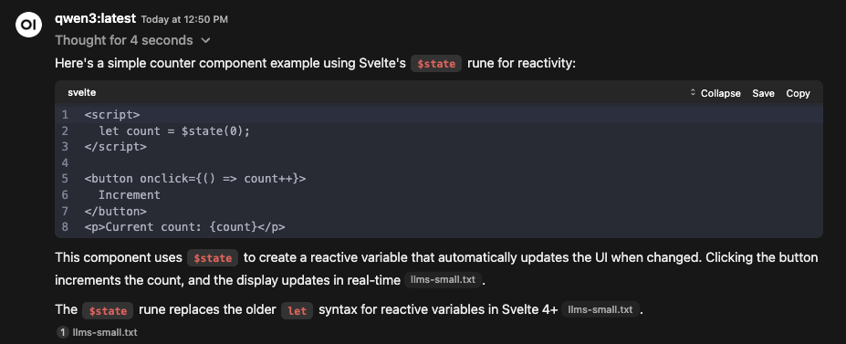

A little over a week ago, I started toying with [running Large Language Models (LLMs) locally using Ollama]().

Apparently, all that did was to get my head spinning with a few ideas. Largely, I was finding myself incredibly curious about the potential of running some of those smaller LLMs locally, and having each of them specialised in a specific domain.

For context, I should probably clarify how I tend to find myself using LLMs.

## The use case

I did have [a bit of a play with genuine vibe coding](), but quickly found that it wasn't for me. I like understanding my codebase, and while certainly impressive that it could churn out functional code it a matter of minutes, I found it more often than not generated _too_ much. I found the sheer amount of code difficult to meaningfully review, and more often than not found myself blowing away all the changes even after a good half hour or so of prompting.

AI has still found a home in my workflow however, but I find my use case to be mostly based around "I want this very specific thing, and I want it done roughly like this". At a high level my workflow looks more like this:

- Creating a database migration
  - Manually create the file, add to context
  - Prompt: _Add a migration that adds a `users` table with `id`, `name`, and `email` columns_
- Creating the model / entity file
  - Manually create the file, add to context
  - Add the migration file we created earlier to context
  - Prompt: _Create an entity that reflects this newly created table_

...and so on.

There's a bit of manual work to say "this is where I want you to put the code", and then letting AI run away with the code that needs to be added to that specific file. Which means, usually I want it to _specifically_ write SQL, or add a new SvelteKit endpoint, or maybe append a route to a .NET controller.

I'm not really leveraging the capabilities of a model that is generally knowledgeable in all these things, all at once.

### The pain point

Honestly, this approach has been working for me. It very quickly gives me a chunk of code that is small enough to either quickly tick off or tweak to my liking, and then I can move on and not need to think about that file again.

The problem I have consistently run into however, is that the training for most (all?) of these LLMs was done prior to the release of Svelte 5. And Svelte 5 brought significant changes to the syntax. As one can imagine, this amounted to a _lot_ of generated code that was just... wrong.

### The litmus test

Given that very clear and resounding pain point, I settled on one specific thing I wanted to achieve &mdash; something that the models I was using were just completely incapable of in their current state.

> Could I teach a model how to write in Svelte 5's syntax?

With my thoughts already occupied with this idea of having a handful of specialised, smaller LLMs, I figured this would be the perfect test.

### The potential solutions

There were a few different ways I could go about trying to solve this problem. To date, I hadn't really leaned too heavily on GitHub Copilot's instructions files, but I figured it would be the first stop.

While that seemed a sane approach, I was very conscious of the fact that using smaller LLMs, I probably needed to be careful with context lengths. While this was likely less of a concern given my short-lived interactions with the LLM, it still felt like a sub-par solution.

Enter a couple of terms that I had seen bandied about, but really at this point hadn't understood. Namely, **system prompts**, **Retrieval-Augmented Generation (RAG)** and **fine-tuning**.

### The reference material

After spending half a day trying to get an LLM to scrape some meaningful data off the Svelte documentation website, I discovered that the Svelte website actually has a page [specific to LLMs](https://svelte.dev/docs/llms).


I also discovered that this `llms.txt` file is a [proposed standard](https://llmstxt.org/), and there's a [handy directory of products and companies](https://directory.llmstxt.cloud/) that have adopted it.

Awesome! What really got me interested, however, was the presence of some text files that had the complete documentation, including compressed versions for smaller LLMs.

- [/llms.txt](https://svelte.dev/llms.txt) — a listing of the available files
- [/llms-full.txt](https://svelte.dev/llms-full.txt) (~1 MB) — complete documentation for Svelte, SvelteKit and the CLI
- [/llms-medium.txt](https://svelte.dev/llms-medium.txt) (~0.5 MB) — compressed documentation for use with medium context windows
- [/llms-small.txt](https://svelte.dev/llms-small.txt) (45 KB) — highly compressed documentation for use with smaller context windows

## GitHub Copilot instructions

I won't go too deep on this one. The short version is that, [following the documentation](https://docs.github.com/en/copilot/how-tos/configure-custom-instructions/add-repository-instructions), I was able to essentially paste the contents of the `llms-*.txt` file into `copilot-instructions.md`. I actually got some really positive results with this approach. Certainly, once plugged into a fully-scaffolded project, it was able to generate some fairly accurate code.

Surprisingly however, I got far better results with the _smaller_ `llms-small.txt` file, which was only 45 KB in size. I figure that this was likely due to the limited context window of the smaller models, although truthfully I didn't really know what to expect if I exceeded that &mdash; assuming this was even the case.

I definitely considered this to be a huge win, and honestly I could have likely stopped here.

In the spirit of full disclosure, I did run this with GPT and Claude as well, as the local models don't seem to be capable of actually generating files etc. Claude was unsurprisingly by far the standout here, but not without its problems. I'll summarise the experience with each of them below.

Generally speaking however, one pleasant experience was that I no longer needed to specify which framework the component needed to be written for. I used a very simple prompt of _"Create a counter component"_. These were all run via GitHub Copilot, with the scaffolded project loaded into VS Code.

| Model           | Notes                                                                                                                                                                                                                                                                                                                                                                                                                                                           |
| --------------- | --------------------------------------------------------------------------------------------------------------------------------------------------------------------------------------------------------------------------------------------------------------------------------------------------------------------------------------------------------------------------------------------------------------------------------------------------------------- |
| Llama3.2 3B     | This one pretty much flopped. The code it spat out didn't use Svelte 5 syntax, and didn't appear to even use [legacy reactive statements](https://svelte.dev/docs/svelte/legacy-reactive-assignments). I'm not being too critical of it at this point however, as it's easily the smallest model used.                                                                                                                                                          |
| Qwen 3 8B       | I've honestly found Qwen to be a little hit and miss in GitHub Copilot specifically, often getting caught up in it's reasoning, getting halfway through a `<think>` block and just... stopping. That said, the one time it actually generated the code I wanted, it was spot on and told me to put in in the correct place.                                                                                                                                     |
| GPT-4.1         | Created a _very_ simple counter component, but put it in the wrong place. Additionally, it was initially created with botched `<script>` tags, and when it finished trying to fix them they were just gone &mdash; resulting in code that wouldn't even compile.                                                                                                                                                                                                |
| Claude Sonnet 4 | I guess someone had to show off, and that someone was Claude. By a _long_ way &mdash; but not necessarily in a _good_ way. Claude checked the project structure, then created the component at the right location. All the correct syntax was used, even cross-referencing other components to confirm. But, in typical Claude fashion, the component was a big 240-line block of code complete with styling and all of the functionality that I _didn't_ want. |

I decided to push Claude a bit further here and managed to vibe code my way to a full-blown storefront for a shoe store. I was actually pretty surprised at how easily I could follow along this time &mdash; but truth be told, I have been working towards a very succinct stack which meant there was just less code to review. Styling however did get a bit messy, and there were a lot of follow-up prompts to try and get it Claude to keep that manageable.

And really, that latter point is one of the main reasons why I didn't want to just stop here. If I were to just continue with this pattern, I was going to be spending all my time fighting against Claude, trying to keep it in check.

Additionally, was I going to just keep needing to add more and more documentation to the instructions? Was there even an `llms-*.txt` file out there for Tailwind? How do I provide this same information to [Open WebUI](https://openwebui.com/)?

## Retrieval-Augmented Generation (RAG)

I'm going to be completely honest here &mdash; I'm not entirely sure how this is supposed to work in the context of _both_ GitHub Copilot and Open WebUI, especially when we're talking about having a highly-specialised model.

My end-goal here was to have a single, unified experience that would be consistent across both GitHub Copilot and Open WebUI. While conceptually speaking RAG isn't overly complex, the best I could really find here was to create a [knowledge base](https://docs.openwebui.com/features/workspace/knowledge/) in Open WebUI, and have it reference the knowledge base itself when generating for a prompt.

Open WebUI also allows us to [create new models](https://docs.openwebui.com/tutorials/tips/rag-tutorial#create-a-custom-model-with-the-knowledge-base) that have a system prompt, as well as a constant reference to a knowledge base.

This actually worked _really_ well, honestly. I wasn't sure that this was conceptually any different to GitHub Copilot's instructions, but it certainly did a far better job of just doing the thing I wanted it to do. Maybe GitHub Copilot was just getting in the way? Anyhow, it felt like the "other side of the coin" to GitHub Copilot's instructions, albeit a little shinier, despite not being plugged into my code editor.



I should also note that when I tried to split up this file and provide it with a larger number of smaller files, it often struggled to find the _right_ files and would start returning plainly incorrect responses. As with GitHub Copilot instructions, this just didn't offer a portable, consistent experience across different interfaces.

In the context of GitHub Copilot specifically, I had to keep telling it to look up the documentation, and even then it often just decided to do things it's own way.

## System prompt

So, feeling like I'd gotten _somewhere_ with the two approaches above, I really wanted to try and consolidate this into a single, consistent model that both GitHub Copilot and Open WebUI could use.

Enter Ollama's Modelfiles. I [touched on these briefly]() while first looking into running models locally, but essentially they provide a way for me to create a completely new model based on an _existing_ model, with some additional tweaks for things such as parameters, **system prompts** and templates. The Modelfile reference can be found [here](https://ollama.readthedocs.io/en/modelfile/).

Considering the success I'd had with the two earlier approaches, I figured that what I really needed was to just have a model that always had this in context, right? That's effectively what was happening with the two separate approaches &mdash; although one was being very explicit in telling GitHub Copilot to _always_ consider the instructions, and the other was giving Open WebUI access to the file and _hoping_ that it always referenced it.

So, it seemed to make sense that I could just whack the contents of `llms-small.txt` into the system prompt of a new model, and then let both GitHub Copilot and Open WebUI use it directly, with no additional context required.

```text
FROM qwen3:8b
SYSTEM {contents of llms-small.txt}
```

Specify the model, and specify the system prompt, which was just a dump of the whole text file. Running the command below then created the new model. Piece of cake!

```sh
ollama create svelte-system-prompt -f ./Modelfile
```

Surprisingly, this just didn't quite work as well as I'd hoped. Not knowing too much about how GitHub Copilot's instructions or Open WebUI's RAG worked in terms of how much weight was given to the additional context, I figured that this might just have been applied a little differently.

In any case, this was a bit of a flop altogether.

## Fine-tuning

All of my reading up until this point had gradually leaned towards this eventuality. With my previous endeavours failing &mdash; or least not quite hitting the mark &mdash; I decided to look into what was actually required to fine-tune a model.

I'll try to touch on the various tools etc. in order here. This isn't quite how it panned out in practice, but it should provide a good overview of what's involved.

Additionally, I decided to move away from trying to train it on Svelte here. I did give it a good crack at first, with varying levels of success. Ultimately I was left unsure as to whether the dataset I had created was actually any good, or whether the models I was using were just too small. Different training methods added another variable into the mix, and on top of that, with Qwen 3 being a reasoning model I made a bit of a mess trying to insert reasoning data into the training dataset.

Anyway, I decided to train it on a much more focused topic &mdash; **the dimensions and markings of a rugby league field**.

I grabbed a PDF from [here](https://www.harrodsport.com/uploads/wysiwyg/file/rugby-league-pitch-dimensions-pdf.pdf), and used that as the basis for my training dataset.

### Datasets

Of course, the easiest way to create a dataset for training an LLM, was to use an LLM. I tried getting a couple of models to scrape the PDF, with ChatGPT being the quickest way to generate a large file.

#### Meta's Synthetic Data Kit

I stumbled across [Meta's Synthetic Data Kit](https://github.com/meta-llama/synthetic-data-kit) which is purpose built for creating these datasets _far_ too late in the piece, however I found that I wasn't able to get a meaningful dataset anyhow. It simply required a model that was too large to run on my machine.

I won't go into details on how to run this, but it looks like an effective tool for slurping up large amounts of data and spitting out a usable dataset.

It just might need either a beefy setup, or using a rented workstation from services like [Vast.ai](https://vast.ai/).

#### Formats

The file itself needs to be a `jsonl` file, which is essentially a file with a JSON object per line. The file I ended up with used the **messages** format, and looked like this (multiplied by many, many rows):

```json
{
  "messages": [
    {
      "role": "user",
      "content": "Summarize the dimensions of a rugby league field."
    },
    {
      "role": "assistant",
      "content": "A rugby league field is 68 metres wide, and 112-122 metres long."
    }
  ]
}
```

Now, a couple of things to note here.

There are actually a few ways to format the dataset. Primarily though, and as might be evident simply by looking at that example, the dataset is essentially a collection of objects that describe a conversation.

The other types are a little simpler, but I initially opted for the more conversational **messages** format. It is however worth noting that this format requires specific models &mdash; or rather, the particular models need to be tuned appropriately. The base llama models for example did not work out of the box, and required me to use the `instruct` tuned versions.

In addition to the **messages** format above, there is also the **completions** format:

```json
{
  "prompt": "Summarize the dimensions of a rugby league field.",
  "completion": "A rugby league field is 68 metres wide, and 112-122 metres long."
}
```

And the **text** format:

```json
{
  "text": "A rugby league field is 68 metres wide, and 112-122 metres long."
}
```

#### Files required

Now, training data on its own is all well and good, but we also need verification data. Since we're using `mlx-lm` for this (sorry, Windows folks &mdash; this one is Apple only, but there are options that should work just as well on Windows), we'll need the following files.

- `train.jsonl`
- `valid.jsonl`

The `valid` data should be smaller than the training data itself &mdash; I've seen a few recommendations, but I just opted for around 10-20% of the training data size. A `test.jsonl` file is also recommended, which can be used to evaluate the model after training.

### mlx-lm

Using `mlx-lm` was actually one of the easier parts to get right. The setup did require using Python, which is always fun considering how infrequently I use it, but once I jogged the memory on how to set up a virtual environment, we had the ball rolling.

Before we get into the individual commands used, it's worth mentioning that `mlx-lm` can pull models directly from [Hugging Face](https://huggingface.co/), meaning we don't need to download models, or figure out where they might be stored. It _does_ however mean that the names might looks a little different to what we're used to seeing with Ollama, but rest assured they're all talking about the same models.

#### Installation

Running `pip install mlx-lm` gets us the basic package, and we can actually start playing with models right off the bat with `mlx_lm.generate --prompt "Hello"`. Starting a continuous chat can be kicked off with `mlx_lm.chat`.

I'm not really sure which model gets used when you don't supply the argument, but providing a `--model` argument will use the specified model. As mentioned, these should can be repositories on Hugging Face, so to grab the Qwen3 1.7B model as an example, we simply need to run `mlx_lm.generate --model qwen/qwen3-1.7b --prompt "Hello"`.

#### Training

Now that we're done playing with our toys, it's time to do our best Sid from Toy Story impersonation and start messing with the guts of our models.


It's probably a good time to talk about what _type_ of training this is. Or, types. And full disclaimer, this is where I started to get a little lost &mdash; suffice to say that I'm still not entirely sure how much of a difference there is between the different types of training that `mlx-lm` offers beyond a very rough idea.

| Type | Description                                                                                                                                                                                                                                                                                                                                           |
| ---- | ----------------------------------------------------------------------------------------------------------------------------------------------------------------------------------------------------------------------------------------------------------------------------------------------------------------------------------------------------- |
| Full | Updates all of the model weights (or parameters) of the pre-trained model. _Very_ resource intensive, and risks "over-fitting", causing a model to "forget" some of its original data.                                                                                                                                                                |
| LoRA | **Low-Rank Adaptation**. We track the _changes_ we want to make to the weights. We can also freeze some of the layers to reduce the number of parameters we're adjusting. Far more efficient while fine-tuning.                                                                                                                                       |
| DoRA | **Weight-Decomposed Low-Rank Adaptation**. Too complicated for me to understand the differences, but the consensus seems to be that it it provides more accurate results than LoRA with similar efficiency gains. More information [here](https://developer.nvidia.com/blog/introducing-dora-a-high-performing-alternative-to-lora-for-fine-tuning/). |

QLoRA is also available, which is simply LoRA that works on quantized models. `mlx-lm` will automatically use this if our `--model` argument points to a quantized model.

Now, this video does a great job of explaining a bunch of things that are well and truly over my head &mdash; it's definitely worth a watch if you're interested in the details.



I tried both full and LoRA training to figure out which was best for my use case. Considering that I wanted a highly specialized model, I wasn't sure if over-fitting would necessarily be the biggest concern.

In any case, the command to run **full** fine-tuning is as follows:

```sh
mlx_lm.lora --train \
            --model qwen/qwen3-1.7b \
            --data data \
            --iters 200 \
            --fine-tune-type full
```

We can easily switch that last argument to `lora` (or `dora`) to use the other types of training. This introduces some additional arguments we can pass, but we can leave them at their defaults for now.

It is worth mentioning here that this is a resource-intensive task, and more than once I found myself running out of memory and watching the training process crash. [This page](https://github.com/ml-explore/mlx-lm/blob/e9b1649662d261e8eefea506c705a7370bb92449/mlx_lm/LORA.md#memory-issues) details a few methods to try and reduce the memory usage, but I found that the biggest impact was simply to use a smaller model &mdash; bearing in mind that this will also reduce the quality of the final model.

Run the command with your desired combination of parameters, and we should end up with a folder called `adapters`. Inside, is the result of our fine-tuning in the form of a Safetensor adapter!

The console output should also look something like the below.

```sh
Loading pretrained model
Fetching 9 files: 100%|██████████████████████████████████████████████████████████████████████████████████████████████████████| 9/9 [00:00<00:00, 13217.34it/s]
Loading datasets
Training
Trainable parameters: 0.056% (0.967M/1720.575M)
Starting training..., iters: 100
Calculating loss...: 100%|██████████████████████████████████████████████████████████████████████████████████████████████████████| 25/25 [00:11<00:00,  2.22it/s]
Iter 1: Val loss 5.646, Val took 11.289s
Iter 10: Train loss 4.538, Learning Rate 1.000e-05, It/sec 1.376, Tokens/sec 317.131, Trained Tokens 2304, Peak mem 4.695 GB
Iter 20: Train loss 2.579, Learning Rate 1.000e-05, It/sec 1.281, Tokens/sec 303.100, Trained Tokens 4671, Peak mem 5.034 GB
Iter 30: Train loss 1.801, Learning Rate 1.000e-05, It/sec 1.545, Tokens/sec 314.796, Trained Tokens 6708, Peak mem 5.034 GB
Iter 40: Train loss 1.522, Learning Rate 1.000e-05, It/sec 1.508, Tokens/sec 336.666, Trained Tokens 8941, Peak mem 5.034 GB
Iter 50: Train loss 1.425, Learning Rate 1.000e-05, It/sec 1.514, Tokens/sec 313.347, Trained Tokens 11010, Peak mem 5.034 GB
Iter 60: Train loss 1.261, Learning Rate 1.000e-05, It/sec 1.577, Tokens/sec 341.066, Trained Tokens 13173, Peak mem 5.034 GB
Iter 70: Train loss 1.162, Learning Rate 1.000e-05, It/sec 1.348, Tokens/sec 318.090, Trained Tokens 15532, Peak mem 5.034 GB
Iter 80: Train loss 1.168, Learning Rate 1.000e-05, It/sec 1.243, Tokens/sec 324.718, Trained Tokens 18144, Peak mem 5.429 GB
Iter 90: Train loss 1.077, Learning Rate 1.000e-05, It/sec 1.415, Tokens/sec 318.347, Trained Tokens 20394, Peak mem 5.429 GB
Calculating loss...: 100%|██████████████████████████████████████████████████████████████████████████████████████████████████████| 25/25 [00:11<00:00,  2.18it/s]
Iter 100: Val loss 1.241, Val took 11.401s
Iter 100: Train loss 0.746, Learning Rate 1.000e-05, It/sec 1.623, Tokens/sec 339.464, Trained Tokens 22486, Peak mem 5.429 GB
Iter 100: Saved adapter weights to adapters/adapters.safetensors and adapters/0000100_adapters.safetensors.
Saved final weights to adapters/adapters.safetensors.
```

Lots of useful information, but critically we want to keep an eye on the **Train / Val loss** values (training and validation loss, respectively). Typically, the lower the better, these essentially indicate how well the model is learning.

My understanding is that we want the validation loss to be close to the the training loss. If the validation loss is significantly lower than the training loss, it indicates under-fitting (lower accuracy relative to the training data), while a significantly higher validation loss indicates over-fitting (higher accuracy relative to the training data, at the cost of existing knowledge).

#### Fusing

Honestly, I prefer to refer to this as "baking" the adapter in. Apparently the community is dead-set on calling it "fusing". That just reminds me of an over-protected childhood where I wasn't allowed to watch Dragonball Z.


Moving on, this step isn't necessarily required, depending on the model we've used. I haven't tried this with one of the compatible models, but Ollama's [Modelfile reference](https://ollama.readthedocs.io/en/modelfile/#safetensor-adapter) does mention the ability to simply reference a Safetensor adapter, which is what we get when we run the `mlx_lm.lora --train` command above.

Since neither of the models I was using were compatible, I did need to produce a fused model. We can actually run the model we used to create the adapter with or without the adapter attached to it (add an `--adapter-path` argument to a `mlx_lm.generate` command to use the adapter), but this wasn't going to give me a model that could be run by Ollama.

To combine the model and adapter, we run the following.

```sh
mlx_lm.fuse --model qwen/qwen3-1.7b \
            --adapter-path adapters \
            --save-path ./model
```

And, once again we'll get a folder called `model`, which contains a _bunch_ of files. This is your model!

If we're itching to see how it works, we can pass `--model ./model` to `mlx_lm.generate` or `mlx_lm.chat`, and it will use the newly created model. Good for a quick turnaround for testing.

### llama.cpp

Once again, this may be unnecessary based on your model. The [Modelfile reference](https://ollama.readthedocs.io/en/modelfile/#build-from-a-safetensors-model) also mentions being able to build from a Safetensors model directly. You'd think at this point I would have just made sure to pick one from this list, right?

Of course, only one of my models was supported. If it's not supported, you'll see something like below when you try to run `ollama create`. If it is supported, it will simply perform the **conversion** itself, and you'll end up with a model that is listed and runnable by Ollama.

```{class=error}
Error: unsupported architecture "Qwen3ForCausalLM"
```

And, that's the key word right there. **Conversion**. To what, exactly? A `.gguf` file! Which stands for the mouthful of syllables that is "GPT-Generated Unified Format". Bottom line is, it's what Ollama wants.

#### Installation

There are a few options for installation, as mentioned on the [`llama.cpp` repository](https://github.com/ggml-org/llama.cpp?tab=readme-ov-file#quick-start).

I didn't have much luck getting the homebrew version to work, so I ended up cloning the repository and building it myself (they have [instructions for that](https://github.com/ggml-org/llama.cpp/blob/master/docs/build.md), too).

#### Converting to .gguf

The bit we really care about is being able to convert the Safetensor model into a `.gguf` file. The script that achieves that is called `convert_hf_to_gguf.py`. I found it easiest to just run this from the directory that had our model in it.

```sh
python ../llama.cpp/convert_hf_to_gguf.py model --outfile model.gguf
```

A keen eye might also notice a script called `convert_lora_to_gguf.py` sitting next to `convert_hf_to_gguf.py`. I had no success in trying to use this, but the suggestion is that we could actually convert the _adapter_ itself to a `.gguf` and pass that to Ollama via a Modelfile's `ADAPTER` instruction, saving us the need to fuse the adapter into the model.

Anyway, once we have our `model.gguf` file, we can now create a model in Ollama that uses it.

### ollama create

We've already seen how to create a model for Ollama, but now we can use the `.gguf` file we created above. We do this by creating a `Modelfile` in the same directory as the `.gguf` file, and referencing our brand spanking new `model.gguf`.

```text
FROM ./model.gguf
```

The command to create our model doesn't change, so we run that. With a more appropriate name.

```sh
ollama create eight-in-a-row -f ./Modelfile
```

`ollama list` should now show us our model, and we can use it as we would any other model we've pulled down from Ollama's library, showing up in both GitHub Copilot and Open WebUI.

#### Chat template

The first big problem I noticed came when I tried to run this. And frustratingly, it _only_ happened when I tried to run it via Ollama.

I was getting some really fun output, where a simple prompt of "Hello" would return a response along the lines of ", I'm going to..." and on and on. Noticing the little comma sneaking in there at the start of the response, it took some pain and searching around before I learned all about stop sequences.

It was only after I spotted someone else showing the output of their model (via `ollama show`) that I noticed a difference between theirs and mine. Theirs had the `TEMPLATE` instruction filled in for their Modelfile. I don't know why it hadn't dawned on me earlier, but the example `TEMPLATE` instruction in the [Modelfile reference](https://ollama.readthedocs.io/en/modelfile/#template) looked a _lot_ like the `template` file [in the Ollama library](https://ollama.com/library/qwen3:1.7b/blobs/ae370d884f10).

Pasting the contents of that file directly into the `TEMPLATE` instruction of my Modelfile, I was able to get the model to respond as expected. After much pain and suffering, I finally had it working!

#### Parameters

While I'm not entirely sure how much of a difference it makes, I did also note that running `ollama show` against the original model had a few parameters set. I'm not entirely sure if they were completely necessary, nor what impact they each have &mdash; I largely noticed them when I was looking to try and explicitly set my stop sequences via `PARAMETER stop <|im_end|>`.

Anyhow, I copied the parameter values from the original model's [Ollama library page](https://ollama.com/library/qwen3:1.7b/blobs/cff3f395ef37). Omitting the `stop` parameters didn't seem to have any impact, but I figured that starting with the remaining values set to those of the original model probably wouldn't be the worst idea.

## Results

To give everyone a level playing field, I decided to scrap all the models I'd been playing with, and really compare these properly. I settled on a consistent set of parameters, and ran the same prompt against each of the models, with the same datasets. I was seeing enough similarity between **LoRA** and **DoRA** training that I didn't feel the need to run both of them against each model, so I decided to just run **Full** and **DoRA** training for each model.

Each of the models would receive the same prompt, with the response pasted in, giving each model up to three attempts and picking the best response. I'll indicate if this was the case in the results below.

Here are the datasets used, in the **messages** format:

- [train.jsonl](files/train.jsonl)
- [valid.jsonl](files/valid.jsonl)

As for the actual parameters, I ran each with **200 iterations** and a **batch size of 1**. For **DoRA** training, I also limited it to training on **4 layers**. This was very focused around reducing the memory usage, as to date I had watched a few training processes crash due to running out of memory. Later on, I do look at the impact of changing the number of layers.


The prompt used will be **_"How big is a rugby league field?"_**. For reference, the answer is **68m wide**, and **112-122m long**.


### Per-model results

In an effort to keep the table headers short, they have been abbreviated. I'll also omit any reasoning returned from the Qwen 3 models, as it was generally quite long and honestly what we _really_ care about is the end result.

- **Type**: The type of training used, as described above
- **Format**: The format of the dataset used for training
- **P%**: The percentage of total model parameters trained
- **TLoss**: Training loss reported by MLX
- **VLoss**: Validation loss reported by MLX
- **Mem**: Peak memory used while training the model

#### Qwen 3 &mdash; 1.7B

| Type     | P%      | TLoss     | VLoss     | Mem       | Response                                                                                                                                                                                                                                                                          |
| -------- | ------- | --------- | --------- | --------- | --------------------------------------------------------------------------------------------------------------------------------------------------------------------------------------------------------------------------------------------------------------------------------- |
| Base     | -       | -         | -         | -         | _[Truncated]_ A rugby league field is a rectangular area measuring 90 meters (300 feet) in length and 50 meters (164 feet) in width. The field is divided into two halves by a 22-meter (72-foot) line running parallel to the goal line, which separates the two halves. _[...]_ |
| **Full** | **47%** | **0.109** | **0.315** | **9.2GB** | **The width of a rugby league field is 68 meters.**                                                                                                                                                                                                                               |
| DoRA     | 0.014%  | 1.448     | 1.487     | 3.8GB     | The pitch of a rugby league field is approximately 100 meters long.                                                                                                                                                                                                               |

#### Qwen 3 &mdash; 4B

| Type     | P%      | TLoss | VLoss | Mem (GB) | Response                                                                                                                                                                                                           |
| -------- | ------- | ----- | ----- | -------- | ------------------------------------------------------------------------------------------------------------------------------------------------------------------------------------------------------------------ |
| **Base** | -       | -     | -     | -        | _[Truncated]_ A rugby league field is a rectangular playing area with the following standard dimensions: Length: 100 meters (approximately 109.36 yards); **Width: 68 meters** (approximately 74.37 yards) _[...]_ |
| Full\*   | 40.147% | 0.158 | 0.289 | 16.5GB   | The dimensions of a rugby league field are between 122 and 182 meters.                                                                                                                                             |
| DoRA     | 0.009%  | 1.055 | 1.108 | 8.5GB    | A rugby league field is 100 meters long and 60 meters wide. The pitch is 100 meters long, and the width is 60 meters. The goal posts are 10 meters apart, and the crossbar is 4 meters wide.                       |

\* I had to limit iterations to 100 for the 3B model, as it was running out of memory

#### Qwen 3 &mdash; 8B

| Type     | P%     | TLoss | VLoss | Mem (GB) | Response                                                                                                                                                                                                              |
| -------- | ------ | ----- | ----- | -------- | --------------------------------------------------------------------------------------------------------------------------------------------------------------------------------------------------------------------- |
| Base     | -      | -     | -     | -        | _[Truncated]_ A rugby league field has specific dimensions that are standardized for competition. Here's a concise breakdown: Standard Dimensions: Length: 100 meters (328 feet); Width: 53 meters (174 feet) _[...]_ |
| Full\*   | -      | -     | -     | -        | -                                                                                                                                                                                                                     |
| DoRA\*\* | 0.005% | 1.185 | 1.212 | 17GB     | _[Truncated]_ The pitch dimensions for rugby league are standardized. Here's the breakdown: **Width: 68 meters**; Length: 126 meters _[...]_                                                                          |

\* Unsurprisingly, this one was never going to fit into the meager 24GB of memory I have on this machine

\*\* While I just managed to get the full fine-tuning in, I had to quantize the model to be able to run it on my machine

#### Llama 3.2 &mdash; 1B

| Type     | P%          | TLoss      | VLoss     | Mem       | Response                                                                                                                                                                                                                                                                                |
| -------- | ----------- | ---------- | --------- | --------- | --------------------------------------------------------------------------------------------------------------------------------------------------------------------------------------------------------------------------------------------------------------------------------------- |
| Base     | -           | -          | -         | -         | _[Truncated]_ Rugby League fields are typically smaller than American football or Australian Rules football fields. _[...]_ Keep in mind that different countries or regions might have slightly varying field sizes, but 100m x 70m is the standard for rugby league fields worldwide. |
| **Full** | **78.745%** | **0.0077** | **0.178** | **9.7GB** | **The total length of a rugby league field is between 112 and 122 meters.**                                                                                                                                                                                                             |
| DoRA     | 0.018%      | 0.871      | 0.942     | 2.8GB     | The size of a rugby league field is typically 130-150 yards (120-137 meters) long. The width can vary, but the most common width is around 55-65 yards (50-59 meters).                                                                                                                  |

#### Llama 3.2 &mdash; 3B

| Type       | P%          | TLoss     | VLoss     | Mem (GB) | Response                                                                                                                                                                                                                                                             |
| ---------- | ----------- | --------- | --------- | -------- | -------------------------------------------------------------------------------------------------------------------------------------------------------------------------------------------------------------------------------------------------------------------- |
| Base       | -           | -         | -         | -        | A rugby league field, also known as a rugby pitch or oval, measures 100 meters (328 feet) long and 70 meters (230 feet) wide. The field is oval in shape, with the goalposts at each end of the field, and the try lines marking the boundaries of the playing area. |
| **Full\*** | **50.135%** | **0.096** | **0.193** | **15GB** | **The size of a rugby league field is between 112 and 122 meters.**                                                                                                                                                                                                  |
| DoRA       | 0.011%      | 0.836     | 0.911     | 7GB      | A rugby league field is 102 meters long and 68 meters wide. The goalposts stand at each end, 9 meters tall.                                                                                                                                                          |

\* I had to limit iterations to 100 for the 3B model, as it was running out of memory

### Summary

I was a bit surprised by the results, with the larger Qwen model not performing quite as well as the smaller one. Perhaps this has something to do with the overall lower number of parameters that the smaller model is working with, resulting in a heavier weighting towards the new values?

The LLama3.2 model was the only one to nail the response across both sizes, which tracks with the general feeling being that it punches above it's weight. I'm not sure that this will translate into writing code where the reasoning capability of Qwen is touted to give it the edge &mdash; but I'm not quite sure at which model size that benefit really kicks in.

The larger of the two Llama3.2 models was clearly the winner in terms of balancing the cost of training with the quality of the results. While it had the wrong length for the DoRA-trained model, it got the width right, and both sizes regurgitated the correct dimensions when undergoing full training.

All this while I was considering whether I had just given the models a garbage dataset, but I decided to forge ahead with some investigation into the number of layers the DoRA training was impacting. Perhaps I could get the balance right between partial and full fine-tuning?

### Number of layers

With Llama3.2's 3B parameter model impressing, I decided to run the experiment with that model (also because it doesn't require the additional conversion step that Qwen does). We can reference the existing results for the four-layer run, and I decided to creep up the layers incrementally.

I also decided to keep the **Full** result here as the benchmark response.

| Layers     | P%          | TLoss     | VLoss     | Mem (GB) | Response                                                                                                       |
| ---------- | ----------- | --------- | --------- | -------- | -------------------------------------------------------------------------------------------------------------- |
| **Full\*** | **50.135%** | **0.096** | **0.193** | **15GB** | **The size of a rugby league field is between 112 and 122 meters.**                                            |
| 4          | 0.011%      | 0.836     | 0.911     | 7GB      | A rugby league field is 102 meters long and 68 meters wide. The goalposts stand at each end, 9 meters tall.    |
| 8          | 0.021%      | 0.506     | 0.571     | 7GB      | The size of a rugby league field is 112 meters long and 68 meters wide.                                        |
| 16         | 0.043%      | 0.318     | 0.421     | 7GB      | A rugby league field is between 112 and 122 meters long.                                                       |
| 24         | 0.064%      | 0.295     | 0.394     | 7GB      | The length of a rugby league field is between 112 and 122 meters, while the width is between 68 and 72 meters. |

I played around with a few of the other parameters, including all 28 layers with 500 iterations, but the results were all pretty similar to the 24-layer run &mdash; although I noticed that at this point the responses started getting much more terse, closer in length to the training data even when the prompt wasn't related to that data at all.

I was fairly impressed at this point. A 3B parameter model is certainly on the smaller end, and the dataset I'd given it was likely not very good, but the responses were consistently coming back with reasonably correct dimensions. It was still tripping over a few things, such as not being able to return the correct depth of the in-goal area.

I decided to offer Qwen a chance at redemption, and ran the same experiment with the 4B model. I was curious to see if it would see similar consistency with a layer number of layers being trained.

| Layers | P%     | TLoss | VLoss | Mem (GB) | Response                                                                                                                                                                                     |
| ------ | ------ | ----- | ----- | -------- | -------------------------------------------------------------------------------------------------------------------------------------------------------------------------------------------- |
| 4      | 0.009% | 1.055 | 1.108 | 8.5GB    | A rugby league field is 100 meters long and 60 meters wide. The pitch is 100 meters long, and the width is 60 meters. The goal posts are 10 meters apart, and the crossbar is 4 meters wide. |
| 24     | 0.052% | 0.401 | 0.594 | 9GB      | The pitch is 100 meters long and 68 meters wide.                                                                                                                                             |

Hmm, still a bit off. It was spitting out a bunch of relevant info in the thinking output that was clearly from the dataset, but it even with follow-up prompts it couldn't figure out the depth of the in-goal area, nor would it factor that into the total length.

## Conclusion

Evidently, I underestimated just how much importance is placed on the dataset itself. I did try throwing some tweaked datasets at the problem, but ran into similar issues. This feels very much like a skill that needs to be honed before I'll truly unlock the potential of fine-tuning.

In any case, I was pleased to see some success with the smaller models, and I think that the results are promising enough to keep banging away at the problem. I can definitely see the potential for this be used to create a bunch of smaller models that can answer questions about specific domains, so long as the datasets are of reasonable enough quality.

I was far more impressed by the results of the Llama 3.2 model, although while I was first toying with fine-tuning, I did note that Qwen 3 was consistently better when it came to writing code.

Based purely on the results posted in here however, it's clear that the **Llama 3.2** model is a great first stop when looking to do any fine-tuning, specifically when fine-tuning **8-16 layers**.

## Next steps

The next steps for me are following on from a seed that was planted in one of the earliest videos I watched on this topic.

In the video, the creator formats his responses as `<calculator>...</calculator>`. The suggestion was, unless I'm hallucinating after spending so long buried in AI, that this model could effectively be trained to recognise a maths question and return a response that can hand off the calculation to an actual calculator.



Which got me thinking... what if instead of a calculator or other tool, we could have a model that called other models?

Essentially, having a small orchestrator model that can interpret what language, framework, domain etc. the prompt is regarding, and then call the appropriate models to handle each specific task?

Whether or not that's even a feasible idea is another story entirely, but it certainly feels like learning how to fine-tune a model has only increased my curiosity rather than quenched it.
