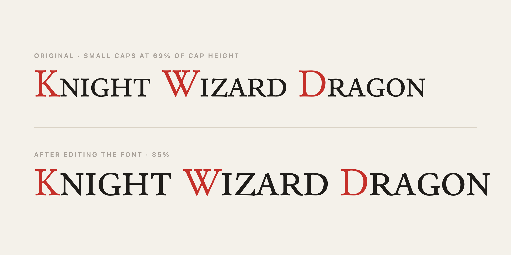

Every so often I'm about to give up on something, or quietly settle for a worse version of it, and then I remember I can just ask Claude. It keeps happening, and it keeps delighting me. A whole category of tasks I'd have filed under _too hard_ or _no idea how_ has slid within reach of my keyboard. I've got a few of these now. Here's a recent one.

I'm building a card game in Godot, and the headings use small caps. The font I picked, [Junicode](https://junicode.sourceforge.io/), has _real_ ones built in, drawn by the type designer rather than faked by shrinking the capitals, so you turn on the OpenType `smcp` feature and they show up. The one thing you can't do is change how big they are. Junicode's small caps sit at about 69% of the capital height, and against my titles that felt like too big a drop—I wanted them a little taller, and there's no setting for that. The feature is a switch, not a dial.

The fix wasn't a mystery. If the small caps are the wrong size you change the small caps, which means changing the font, and I just had no idea _how_. A font file is an opaque binary blob to me, and "resize a subset of the glyphs" sits squarely in the pile of things I know are possible and can't begin to do. So normally this is where I'd reach for the fake: render the first letter full size and the rest as smaller capitals, which looks roughly right and is wrong in every way that matters once you've noticed. Not because it's the better fix, but because it's the one I knew how to build.

This time I just asked. Claude went straight at the font with [fontTools](https://github.com/fonttools/fonttools), a Python library I'd never heard of. It found the small-cap glyphs, scaled them up to the ratio I wanted, fixed the spacing to match, and wrote the file back out. The `smcp` feature still works exactly as before; the letters are just taller now.

Nothing in the game knows it happened. There's still a single `smcp` switch, and the proportion I'd been fighting just lives in the font where it belongs—if 85% turns out to still be slightly off, I re-run the script with a different number.

The font isn't really the point. What gets me is the little jolt of _oh, right, I can just do that_, and how often it comes around. I still couldn't edit a font by hand, and I'd never heard of the tool that did it an hour before it did, and neither turned out to matter. The gap between the fix I want and the fix I can actually pull off keeps shrinking, and I keep being caught pleasantly off guard by it.
