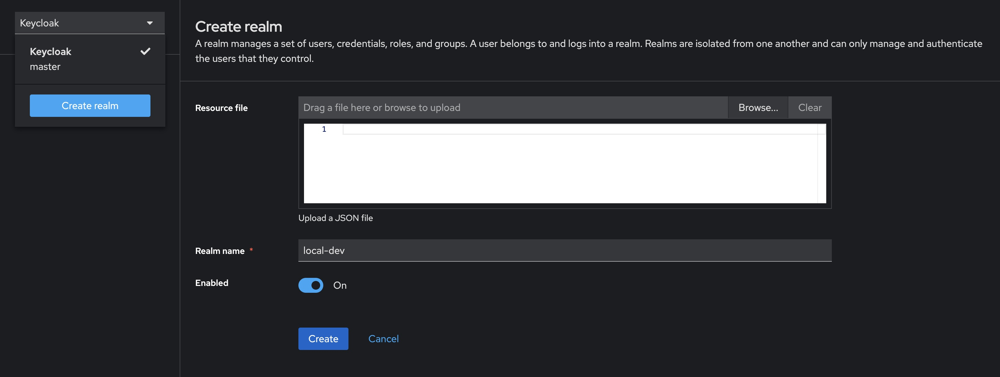
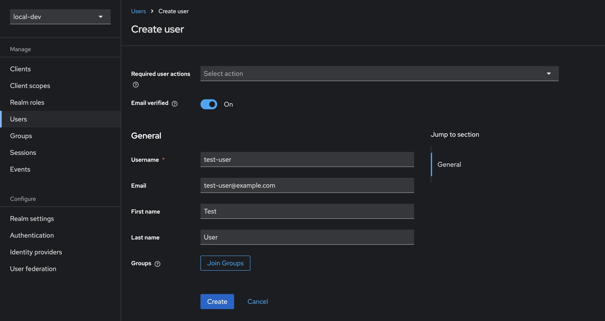
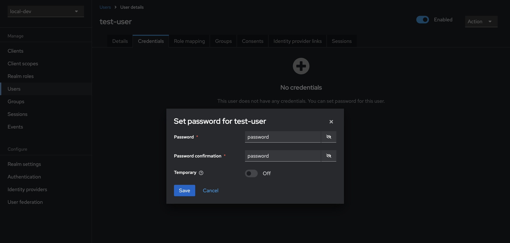
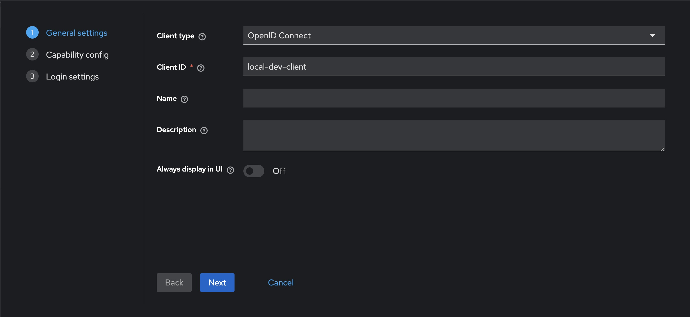
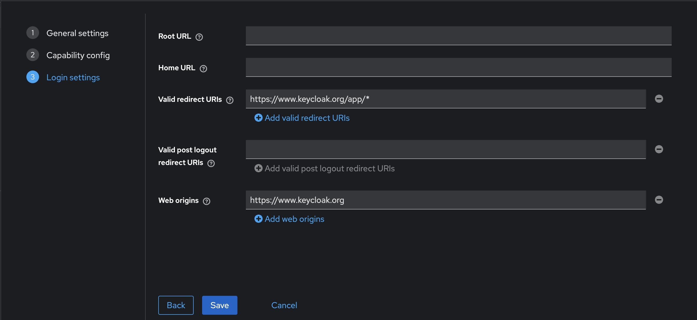
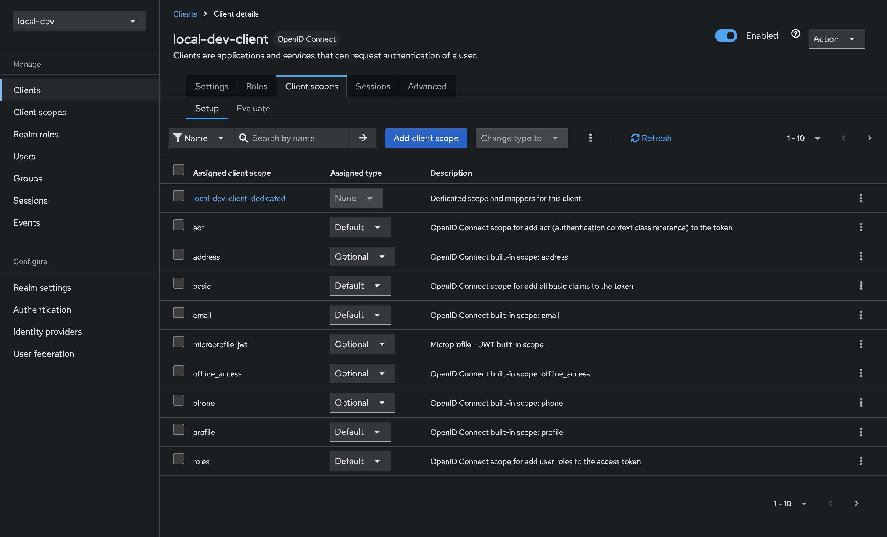
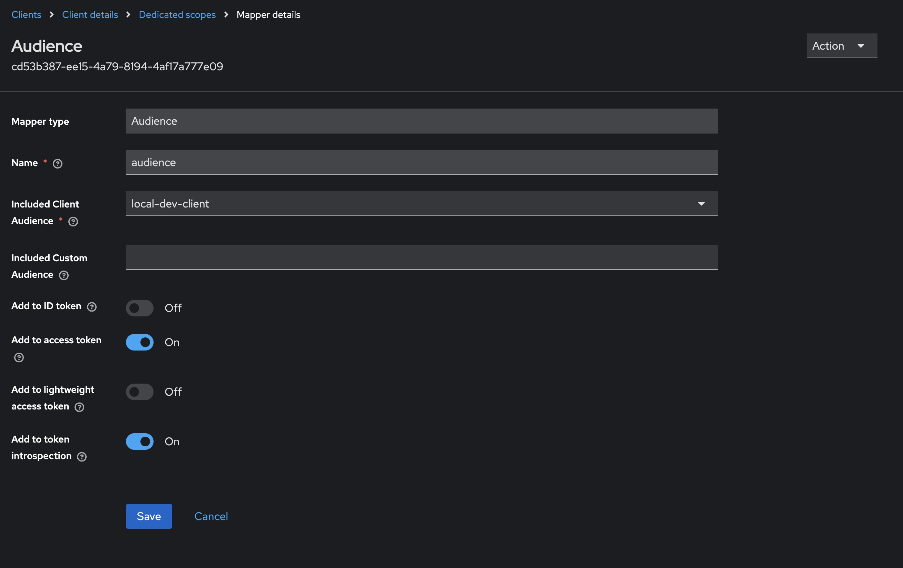
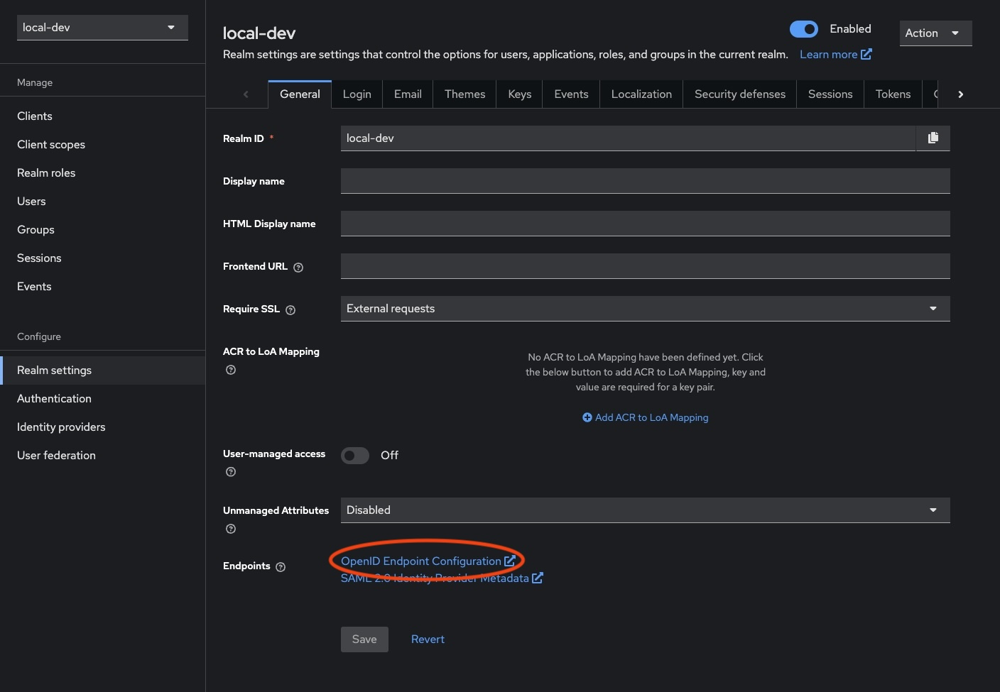

[Keycloak](https://www.keycloak.org/) is an open-source identity and access management solution designed to manage users and secure applications. It provides features such as single sign-on (SSO), social login integration, and user federation.

It also offers a user-friendly administration console for managing users, roles, and permissions, as well as customizable user interfaces for login, registration, and account management

**Why use a local auth server?**

Being able to run a local auth server means we won't find ourselves blocked while waiting for a client to configure their own auth server. Often picking up a piece of work involving client-owned authentication results in some delays while requests are sent around, and more often than not leaves us unable to write our application code until the auth server has been configured.

It also allows us to have full control over our own local dev environment, including the ability to create any number of users with specific roles. This means we can easily run multi-user scenarios locally for testing, demoes or debugging, and prevents needing to comment out or tweak application code just to replicate a bug.

## Getting started

To start the Keycloak dev server, simply run the following command in your terminal. This will expose Keycloak on port `8080`, and creates an initial admin user with the credentials `admin:admin`.

```sh {linenos=false}
docker run -p 8080:8080 -e KEYCLOAK_ADMIN=admin -e KEYCLOAK_ADMIN_PASSWORD=admin quay.io/keycloak/keycloak:25.0.2 start-dev
```

Opening [http://localhost:8080/](http://localhost:8080/) in your browser should show you the login page for the Keycloak admin interface. Sign in with the previously created admin credentials `admin:admin`. Once logged in, you should be greeted with the Keycloak admin console.

## Configuring Keycloak

### Creating a realm

1. Open the admin console and login using our admin credentials `admin:admin`
2. Open the dropdown that currently says **Keycloak** and select **Create realm**
3. Enter the desired name for the realm, in this case using `local-dev`
4. Finish creating the realm by clicking the "Create" button



### Adding a user

1. Select **Users** from the sidebar, then click **Create new user**
2. Fill in the details for a new user, in this case using `test-user` as the username
3. (Optional) ticking **Email verified** means our test user can skip this step
4. Select **Credentials** from the tab bar, then click **Set password**
5. Enter and confirm the user's password, in this case using `password`
6. (Optional) uncheck **Temporary** to prevent needing to update the password at first login for this user

 

You can test the newly created user's account at [http://localhost:8080/realms/myrealm/account](http://localhost:8080/realms/myrealm/account). Opening the link and signing in with our user's credentials `test-user:password` gives us access to a user-facing interface that allows updating of details, passwords, and the setting up of two-factor authentication.

### Registering a client

1. Select **Clients** in the sidebar, then click **Create client**
2. Make sure to leave `OpenID Connect` selected as the **Client type**
3. Enter the desired client name, in this case using `local-dev-client`
4. Click **Next**
5. Ensure that **Standard flow** remains checked
6. Click **Next**
7. To facilitate testing, make the following changes to the **Login settings**
   - Set **Valid redirect URIs** to `https://www.keycloak.org/app/*`
   - Set **Web origins** to `https://www.keycloak.org`
8. Click **Save**

 

You can test the newly created client by using [https://www.keycloak.org/app/](https://www.keycloak.org/app/). Enter the details from our previously created realm and client, and press **Save**. Once saved, you can sign in with the test user created earlier.

#### Audience claim

You may also need to set the audience claim correctly, which might become apparent when wiring this up to an application.

1. Select **Clients** in the sidebar, select our newly created client `local-dev-client`, then select **Client scopes** from the tabs along the top
2. Select the **Assigned client scope** named `<client-id>-dedicated`, in our case `local-dev-client-dedicated`
3. Click the **Add mapper** button, and select **By configuration**
4. Select **Audience** from the list of options, and then configure as per below
   - **Name** can be whatever you choose, I've gone with `audience` here
   - Selecting **Included Client Audience** will open a dropdown; select the newly created client `local-dev-client`

 

This should finish configuring our client to correctly populate the audience claim in any generated tokens.

## Persisting Keycloak configuration

Of course, once we tear down our Docker container we lose any of the previously configured values. [Docker volumes](https://docs.docker.com/storage/volumes/) provide a nice solution here, which we can easily configure using `docker-compose`.

Save the following as `docker-compose.yml` and run by calling `docker-compose up -d` in your terminal.



```yaml
services:
  keycloak:
    image: quay.io/keycloak/keycloak:25.0.2
    container_name: keycloak
    ports:
      - 8080:8080
    environment:
      - KEYCLOAK_ADMIN=admin
      - KEYCLOAK_ADMIN_PASSWORD=admin
    volumes:
      - keycloak-data:/opt/keycloak/data/
    restart: always
    command:
      - "start-dev"
volumes:
  keycloak-data:
    name: keycloak-data
```

## Importing and exporting configuration

Keycloak allows us to import and export realms, which can make it much easier to share configurations amongst team members.

### Exporting an existing realm

The following instructions to export a realm from Keycloak will assume the use of a docker compose file similar to this.



```yaml
services:
  keycloak:
    image: quay.io/keycloak/keycloak:25.0.2
    container_name: keycloak
    ports:
      - 8080:8080
    environment:
      - KEYCLOAK_ADMIN=admin
      - KEYCLOAK_ADMIN_PASSWORD=admin
    volumes:
      - keycloak-data:/opt/keycloak/data/
    restart: always
    command:
      - "start-dev"
volumes:
  keycloak-data:
    name: keycloak-data
```

The easiest way to export a realm when using docker compose is to add a second compose file. Call this `docker-compose.export.yml`.



```yaml
services:
  keycloak:
    command: "export --dir /opt/keycloak/data/export/ --realm local-dev --users realm_file"
    volumes:
      - ./output:/opt/keycloak/data/export
```

Run the following in your terminal to export the configured realm.

```sh {linenos=false}
docker-compose -f "docker-compose.yml" -f "docker-compose.export.yml" up --exit-code-from keycloak
```

You should now have a directory called `output` that contains a file called `local-dev-realm.json`. This file can be imported manually when creating a new realm, or Keycloak can be configured to automatically import this realm when the service starts (attempting to import an already-existing realm will fail to prevent overwrites).

An important caveat to note is that Keycloak is designed to export from a _stopped_ server, meaning you will need to ensure that your configuration has been persisted through some means.

Keycloak also allows for multiple options when it comes to if and how users should be exported. The example above uses the simpler approach of combining them into the realm file. See the [Keycloak documentation](https://www.keycloak.org/server/importExport) for more details.

### Importing a realm from a file

The updated Docker compose file below uses a bind mount to an `import` directory. Once any `realm.json` files have been exported, placing the files in the `import` directory will allow Keycloak to automatically pick those realms up and import them on first run.

Update your `docker-compose.yml` to the following and run by calling `docker-compose up -d` in your terminal.



```yaml
services:
  keycloak:
    image: quay.io/keycloak/keycloak:25.0.2
    container_name: keycloak
    ports:
      - 8080:8080
    environment:
      - KEYCLOAK_ADMIN=admin
      - KEYCLOAK_ADMIN_PASSWORD=admin
    volumes:
      - ./import:/opt/keycloak/data/import
    restart: always
    command:
      - "start-dev"
      - "--import-realm"
```

Note the removal of the persisted Docker volume &mdash; this effectively gives us an auth server that can be modified on the fly, but will reset back to the exported realm whenever it restarts.

As Keycloak won't overwrite an existing realm with the import method, the Docker volume can always be reintroduced and will essentially mean our import file serves as a starting point upon which changes can be persisted.

## Using Keycloak with a React SPA + MSAL

One of my main motivations for looking into Keycloak was to decouple local development from a third party authentication server which needed to be configured by the client. More often than not, this is done using Microsoft Entra ID, and in a typical React application we would use MSAL to set up client authentication.

This serves as a short guide to resolving some of the issues encountered when trying to use MSAL with a locally-configured Keycloak server.

See the example repo [here](https://github.com/vivecuervo7/local-auth-with-keycloak-example).

### Running Keycloak with HTTPS

Keycloak will be exposed at [http://localhost:8080](http://localhost:8080) which is all well and good for most cases, however I was wanting to drop this in as a local auth replacement for MSAL in a typical React project.

Since `@azure/msal-browser` [doesn't allow us to use a HTTP authority](https://github.com/AzureAD/microsoft-authentication-library-for-js/issues/6631), the default Keycloak endpoint won't work. The following steps allow for running Keycloak with HTTPS.

#### Creating a self-signed certificate using dotnet dev-certs

Since dotnet-certs are typically used for local dev when building .NET applications, it seemed easiest to simply repurpose the same tooling to create other local dev certs.

Create the self-signed certificate by running the following in your terminal, in this case using `password` as the credential to create the following two files: `certificate.crt` and `certificate.key`.

```sh {linenos=false}
dotnet dev-certs https -ep ./certificate.crt -p password --trust --format PEM
```

Use `openssl` to decrypt the certificate key, overwriting `certificate.key` with the decrypted copy.

```sh {linenos=false}
openssl rsa -in certificate.key  -out certificate.key
```

As a matter of preference, I tend to rename these files to `cert.pem` and `key.pem`. The remainder of this guide assumes this naming.

#### Running Keycloak with the certificate

The following changes expect that the certificate files we just created are present in a `certificates` directory. Go ahead and create the folder and copy both the certificate and key into it.

Create or update your `docker-compose.yml` file to the following and run by calling `docker-compose up -d` in your terminal.



```yml
services:
  keycloak:
    image: quay.io/keycloak/keycloak:25.0.2
    container_name: keycloak
    ports:
      - 8080:8080
      - 8443:8443
    environment:
      - KEYCLOAK_ADMIN=admin
      - KEYCLOAK_ADMIN_PASSWORD=admin
    volumes:
      - ./import:/opt/keycloak/data/import
      - ./certificates:/opt/keycloak/data/certificates
    restart: always
    command:
      - "start-dev"
      - "--import-realm"
      - "--https-certificate-file=/opt/keycloak/data/certificates/cert.pem"
      - "--https-certificate-key-file=/opt/keycloak/data/certificates/key.pem"
```

You can now access the Keycloak server at either [http://localhost:8080](http://localhost:8080) or [https://localhost:8443](https://localhost:8443). Using the HTTPS endpoint should allow us to use Keycloak with [@azure/msal-browser](https://github.com/AzureAD/microsoft-authentication-library-for-js).

### Configuring MSAL to work with Keycloak

Without delving too deep into how we might hold MSAL in a typical React application, the biggest change we need to make is to manually provide some of the configuration that usually works out of the box with MSAL when using Microsoft Entra ID.

```typescript
const msalConfig = {
  auth: {
    clientId: "local-dev-client",
    authority: "https://localhost:8443/realms/local-dev",
    knownAuthorities: ["https://localhost:8443/realms/local-dev"],
    redirectUri: "https://localhost:5173",
    postLogoutRedirectUri: "https://localhost:5173",
    protocolMode: ProtocolMode.OIDC,
    authorityMetadata: JSON.stringify({
      authorization_endpoint:
        "https://localhost:8443/realms/local-dev/protocol/openid-connect/auth",
      token_endpoint:
        "https://localhost:8443/realms/local-dev/protocol/openid-connect/token",
      issuer: "https://localhost:8443/realms/local-dev",
      userinfo_endpoint:
        "https://localhost:8443/realms/local-dev/protocol/openid-connect/userinfo",
      end_session_endpoint:
        "https://localhost:8443/realms/local-dev/protocol/openid-connect/logout",
    }),
  },
};

const msalInstance = new PublicClientApplication(msalConfig);
```

There are of course a few more data points required, which may then need to be manually provided again when configuring this to work with both Keycloak locally _and_ Microsoft Entra ID when deployed. A small amount of pain to endure for the benefits of decoupling ourselves from a customer-provided auth server.

Of course, in practice we would make these string more easily configurable, but I've opted to hardcode them to better demonstrate.

See the [sample repo](https://github.com/vivecuervo7/local-auth-with-keycloak-example) to see these changes in more context.

**OpenID Endpoint Configuration**

The trickier part here might be knowing where to obtain these strings from. Navigating to the realm settings of our Keycloak server's admin interface, find the **OpenID Endpoint Configuration** link.



Opening this will yield a new page with all of our endpoints that we need to populate this config.

```json
{
  "issuer": "https://localhost:8443/realms/local-dev",
  "authorization_endpoint": "https://localhost:8443/realms/local-dev/protocol/openid-connect/auth",
  "token_endpoint": "https://localhost:8443/realms/local-dev/protocol/openid-connect/token",
  "userinfo_endpoint": "https://localhost:8443/realms/local-dev/protocol/openid-connect/userinfo",
  "end_session_endpoint": "https://localhost:8443/realms/local-dev/protocol/openid-connect/logout"
  // ...
}
```

#### Running React with HTTPS

We may also need to run our React application with HTTPS as well. To achieve this, we need to update `vite.config.ts` to contain the following. Fortunately, we can repurpose the same certificates we created for Keycloak.

Note that while omitted below, it may be useful to split the `serve` and `build` commands so we keep our changes away from any deployed code.



```diff
import { defineConfig, loadEnv } from "vite";
import react from "@vitejs/plugin-react-swc";

export default defineConfig(({ command, mode }) => {
+ process.env = { ...process.env, ...loadEnv(mode, process.cwd()) };

  return {
    plugins: [react()],
+   server: {
+     https: {
+       cert: process.env.VITE_CERT ?? "",
+       key: process.env.VITE_CERT_KEY ?? "",
+     },
+   },
  };
});
```

And then we'll also need to add a `.env` (and `.env.local`) with the correct paths.



```diff
+ VITE_CERT=../local-dev/certificates/cert.pem
+ VITE_CERT_KEY=../local-dev/certificates/key.pem
```

Now running the React application with `pnpm dev` should serve it using HTTPS.

#### Missing parameter: id_token_hint

I did run into a small issue with the setup, where a user was unable to logout completely. Attempting to logout was yielding an error due to the absence of either a `client_id` or `id_token_hint` when requesting the `post_logout_redirect_uri`.

Ultimately, this was easily resolved by obtaining an access token _before_ attempting to logout, and using the `id_token` from that.



```typescript
const handleLogout = async () => {
  const response = await instance.acquireTokenSilent({
    scopes: ["openid"],
  });

  await instance.logoutRedirect({
    idTokenHint: response.idToken,
  });
};
```

### Optional: Adding a secured .NET backend

The [sample repo](https://github.com/vivecuervo7/local-auth-with-keycloak-example) contains code that also connects the React application to a .NET API with a secured endpoint.

The configuration here is relatively straightforward to work with our local Keycloak server.

The main changes we'll need to make are to `Program.cs`, where we simply add our necessary configuration (truncated for brevity).



```diff
+ using Microsoft.AspNetCore.Authentication.JwtBearer;

  var builder = WebApplication.CreateBuilder(args);

+ builder
+     .Services.AddAuthentication(options =>
+     {
+         options.DefaultAuthenticateScheme = JwtBearerDefaults.AuthenticationScheme;
+         options.DefaultChallengeScheme = JwtBearerDefaults.AuthenticationScheme;
+     })
+     .AddJwtBearer(options => builder.Configuration.Bind("JwtBearerOptions", options));

+ builder
+     .Services.AddAuthorizationBuilder()
+     .AddDefaultPolicy("RequireAuthenticatedUser", policy => policy.RequireAuthenticatedUser());

  var app = builder.Build();

  app.UseHttpsRedirection();
+ app.UseAuthentication();
+ app.UseAuthorization();

  app.MapGet("/weatherforecast", () => [])
    .WithName("GetWeatherForecast")
    .WithOpenApi()
+   .RequireAuthorization();

  await app.RunAsync();
```

And providing the appropriate configuration via appsettings.



```diff
{
+ "JwtBearerOptions": {
+   "Authority": "https://localhost:8443/realms/local-dev",
+   "Audience": "local-dev-client"
+ }
}
```

Running the code in the sample repo will result in the React application displaying a button which calls the `/weatherforecast` endpoint to illustrate the correct responses are returned depending on whether the client has been authenticated or not.
