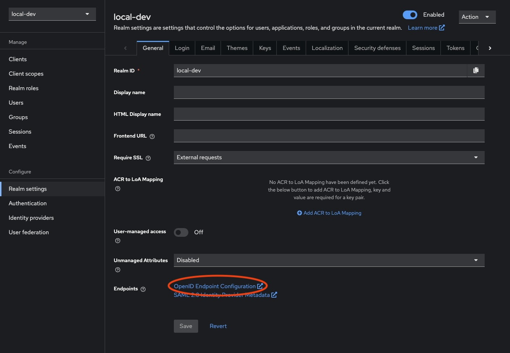

## Context

One of my main motivations for looking into Keycloak was to decouple local development from a third party authentication server which needed to be configured by the client. More often than not, this is done using Microsoft Entra ID, and in a typical React application we would use MSAL to set up client authentication.

This serves as a short guide to resolving some of the issues encountered when trying to use MSAL with a locally-configured Keycloak server.

See the example repo [here](https://github.com/vivecuervo7/local-auth-with-keycloak-example).

## Running Keycloak with HTTPS

Keycloak will be exposed at [http://localhost:8080](http://localhost:8080) which is all well and good for most cases, however I was wanting to drop this in as a local auth replacement for MSAL in a typical React project.

Since `@azure/msal-browser` [doesn't allow us to use a HTTP authority](https://github.com/AzureAD/microsoft-authentication-library-for-js/issues/6631), the default Keycloak endpoint won't work. The following steps allow for running Keycloak with HTTPS.

### Creating a self-signed certificate using dotnet dev-certs

Since dotnet-certs are typically used for local dev when building .NET applications, it seemed easiest to simply repurpose the same tooling to create other local dev certs.

Create the self-signed certificate by running the following in your terminal, in this case using `password` as the credential to create the following two files: `certificate.crt` and `certificate.key`.

```sh {linenos=false}
dotnet dev-certs https -ep ./certificate.crt -p password --trust --format PEM
```

Use `openssl` to decrypt the certificate key, overwriting `certificate.key` with the decrypted copy.

```sh {linenos=false}
openssl rsa -in certificate.key  -out certificate.key
```

As a matter of preference, I tend to rename these files to `cert.pem` and `key.pem`. The remainder of this guide assumes this naming.

### Running Keycloak with the certificate

The following changes expect that the certificate files we just created are present in a `certificates` directory. Go ahead and create the folder and copy both the certificate and key into it.

Create or update your `docker-compose.yml` file to the following and run by calling `docker-compose up -d` in your terminal.



```yml
services:
  keycloak:
    image: quay.io/keycloak/keycloak:25.0.2
    container_name: keycloak
    ports:
      - 8080:8080
      - 8443:8443
    environment:
      - KEYCLOAK_ADMIN=admin
      - KEYCLOAK_ADMIN_PASSWORD=admin
    volumes:
      - ./import:/opt/keycloak/data/import
      - ./certificates:/opt/keycloak/data/certificates
    restart: always
    command:
      - "start-dev"
      - "--import-realm"
      - "--https-certificate-file=/opt/keycloak/data/certificates/cert.pem"
      - "--https-certificate-key-file=/opt/keycloak/data/certificates/key.pem"
```

You can now access the Keycloak server at either [http://localhost:8080](http://localhost:8080) or [https://localhost:8443](https://localhost:8443). Using the HTTPS endpoint should allow us to use Keycloak with [@azure/msal-browser](https://github.com/AzureAD/microsoft-authentication-library-for-js).

## Configuring MSAL to work with Keycloak

Without delving too deep into how we might hold MSAL in a typical React application, the biggest change we need to make is to manually provide some of the configuration that usually works out of the box with MSAL when using Microsoft Entra ID.

```typescript
const msalConfig = {
  auth: {
    clientId: "local-dev-client",
    authority: "https://localhost:8443/realms/local-dev",
    knownAuthorities: ["https://localhost:8443/realms/local-dev"],
    redirectUri: "https://localhost:5173",
    postLogoutRedirectUri: "https://localhost:5173",
    protocolMode: ProtocolMode.OIDC,
    authorityMetadata: JSON.stringify({
      authorization_endpoint:
        "https://localhost:8443/realms/local-dev/protocol/openid-connect/auth",
      token_endpoint:
        "https://localhost:8443/realms/local-dev/protocol/openid-connect/token",
      issuer: "https://localhost:8443/realms/local-dev",
      userinfo_endpoint:
        "https://localhost:8443/realms/local-dev/protocol/openid-connect/userinfo",
      end_session_endpoint:
        "https://localhost:8443/realms/local-dev/protocol/openid-connect/logout",
    }),
  },
};

const msalInstance = new PublicClientApplication(msalConfig);
```

There are of course a few more data points required, which may then need to be manually provided again when configuring this to work with both Keycloak locally _and_ Microsoft Entra ID when deployed. A small amount of pain to endure for the benefits of decoupling ourselves from a customer-provided auth server.

Of course, in practice we would make these string more easily configurable, but I've opted to hardcode them to better demonstrate.

See the [sample repo](https://github.com/vivecuervo7/local-auth-with-keycloak-example) to see these changes in more context.

**OpenID Endpoint Configuration**

The trickier part here might be knowing where to obtain these strings from. Navigating to the realm settings of our Keycloak server's admin interface, find the **OpenID Endpoint Configuration** link.



Opening this will yield a new page with all of our endpoints that we need to populate this config.

```json
{
  "issuer": "https://localhost:8443/realms/local-dev",
  "authorization_endpoint": "https://localhost:8443/realms/local-dev/protocol/openid-connect/auth",
  "token_endpoint": "https://localhost:8443/realms/local-dev/protocol/openid-connect/token",
  "userinfo_endpoint": "https://localhost:8443/realms/local-dev/protocol/openid-connect/userinfo",
  "end_session_endpoint": "https://localhost:8443/realms/local-dev/protocol/openid-connect/logout"
  // ...
}
```

### Running React with HTTPS

We may also need to run our React application with HTTPS as well. To achieve this, we need to update `vite.config.ts` to contain the following. Fortunately, we can repurpose the same certificates we created for Keycloak.

Note that while omitted below, it may be useful to split the `serve` and `build` commands so we keep our changes away from any deployed code.



```diff
import { defineConfig, loadEnv } from "vite";
import react from "@vitejs/plugin-react-swc";

export default defineConfig(({ command, mode }) => {
+ process.env = { ...process.env, ...loadEnv(mode, process.cwd()) };

  return {
    plugins: [react()],
+   server: {
+     https: {
+       cert: process.env.VITE_CERT ?? "",
+       key: process.env.VITE_CERT_KEY ?? "",
+     },
+   },
  };
});
```

And then we'll also need to add a `.env` (and `.env.local`) with the correct paths.



```diff
+ VITE_CERT=../local-dev/certificates/cert.pem
+ VITE_CERT_KEY=../local-dev/certificates/key.pem
```

Now running the React application with `pnpm dev` should serve it using HTTPS.

### Missing parameter: id_token_hint

I did run into a small issue with the setup, where a user was unable to logout completely. Attempting to logout was yielding an error due to the absence of either a `client_id` or `id_token_hint` when requesting the `post_logout_redirect_uri`.

Ultimately, this was easily resolved by obtaining an access token _before_ attempting to logout, and using the `id_token` from that.



```typescript
const handleLogout = async () => {
  const response = await instance.acquireTokenSilent({
    scopes: ["openid"],
  });

  await instance.logoutRedirect({
    idTokenHint: response.idToken,
  });
};
```

## Optional: Adding a secured .NET backend

The [sample repo](https://github.com/vivecuervo7/local-auth-with-keycloak-example) contains code that also connects the React application to a .NET API with a secured endpoint.

The configuration here is relatively straightforward to work with our local Keycloak server.

The main changes we'll need to make are to `Program.cs`, where we simply add our necessary configuration (truncated for brevity).



```diff
+ using Microsoft.AspNetCore.Authentication.JwtBearer;

  var builder = WebApplication.CreateBuilder(args);

+ builder
+     .Services.AddAuthentication(options =>
+     {
+         options.DefaultAuthenticateScheme = JwtBearerDefaults.AuthenticationScheme;
+         options.DefaultChallengeScheme = JwtBearerDefaults.AuthenticationScheme;
+     })
+     .AddJwtBearer(options => builder.Configuration.Bind("JwtBearerOptions", options));

+ builder
+     .Services.AddAuthorizationBuilder()
+     .AddDefaultPolicy("RequireAuthenticatedUser", policy => policy.RequireAuthenticatedUser());

  var app = builder.Build();

  app.UseHttpsRedirection();
+ app.UseAuthentication();
+ app.UseAuthorization();

  app.MapGet("/weatherforecast", () => [])
    .WithName("GetWeatherForecast")
    .WithOpenApi()
+   .RequireAuthorization();

  await app.RunAsync();
```

And providing the appropriate configuration via appsettings.



```diff
{
+ "JwtBearerOptions": {
+   "Authority": "https://localhost:8443/realms/local-dev",
+   "Audience": "local-dev-client"
+ }
}
```

Running the code in the sample repo will result in the React application displaying a button which calls the `/weatherforecast` endpoint to illustrate the correct responses are returned depending on whether the client has been authenticated or not.
