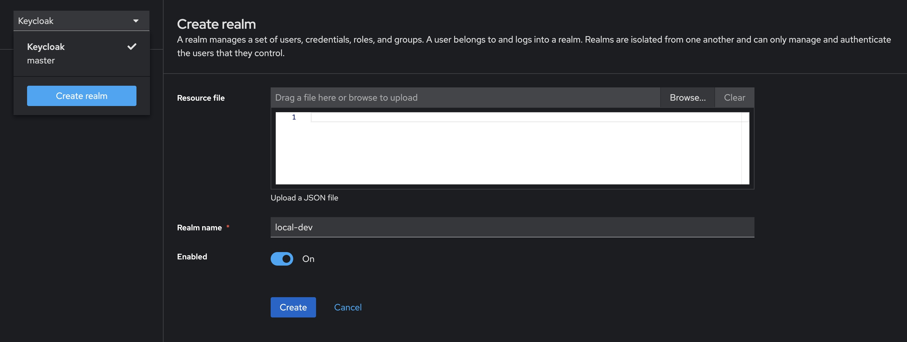
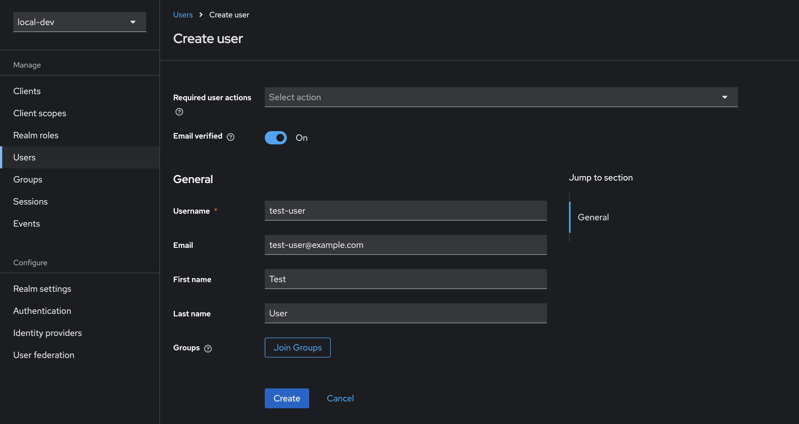
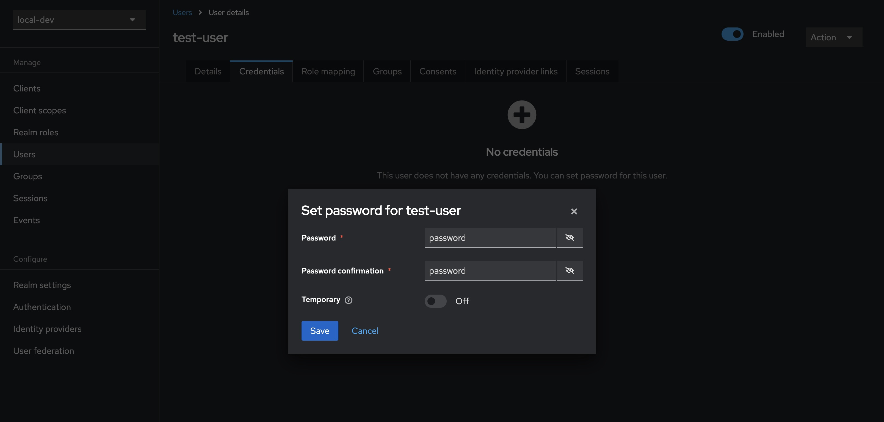
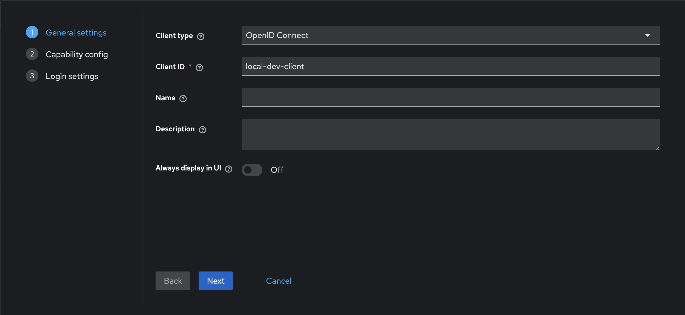
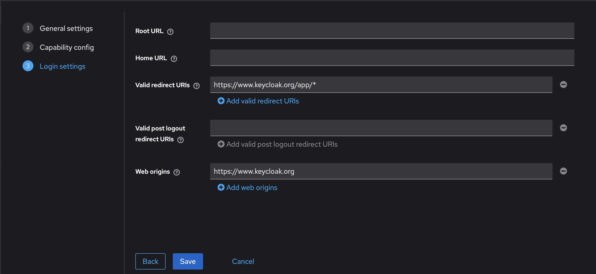
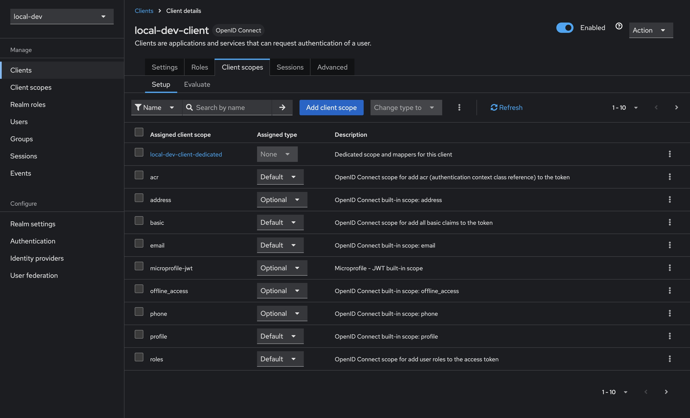
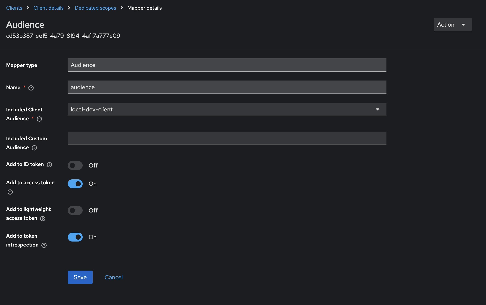

[Keycloak](https://www.keycloak.org/) is an open-source identity and access management solution designed to manage users and secure applications. It provides features such as single sign-on (SSO), social login integration, and user federation.

It also offers a user-friendly administration console for managing users, roles, and permissions, as well as customizable user interfaces for login, registration, and account management

**Why use a local auth server?**

Being able to run a local auth server means we won't find ourselves blocked while waiting for a client to configure their own auth server. Often picking up a piece of work involving client-owned authentication results in some delays while requests are sent around, and more often than not leaves us unable to write our application code until the auth server has been configured.

It also allows us to have full control over our own local dev environment, including the ability to create any number of users with specific roles. This means we can easily run multi-user scenarios locally for testing, demoes or debugging, and prevents needing to comment out or tweak application code just to replicate a bug.

## Getting started

To start the Keycloak dev server, simply run the following command in your terminal. This will expose Keycloak on port `8080`, and creates an initial admin user with the credentials `admin:admin`.

```sh {linenos=false}
docker run -p 8080:8080 -e KEYCLOAK_ADMIN=admin -e KEYCLOAK_ADMIN_PASSWORD=admin quay.io/keycloak/keycloak:25.0.2 start-dev
```

Opening [http://localhost:8080/](http://localhost:8080/) in your browser should show you the login page for the Keycloak admin interface. Sign in with the previously created admin credentials `admin:admin`. Once logged in, you should be greeted with the Keycloak admin console.

## Configuring Keycloak

### Creating a realm

1. Open the admin console and login using our admin credentials `admin:admin`
2. Open the dropdown that currently says **Keycloak** and select **Create realm**
3. Enter the desired name for the realm, in this case using `local-dev`
4. Finish creating the realm by clicking the "Create" button



### Adding a user

1. Select **Users** from the sidebar, then click **Create new user**
2. Fill in the details for a new user, in this case using `test-user` as the username
3. (Optional) ticking **Email verified** means our test user can skip this step
4. Select **Credentials** from the tab bar, then click **Set password**
5. Enter and confirm the user's password, in this case using `password`
6. (Optional) uncheck **Temporary** to prevent needing to update the password at first login for this user

 

You can test the newly created user's account at [http://localhost:8080/realms/myrealm/account](http://localhost:8080/realms/myrealm/account). Opening the link and signing in with our user's credentials `test-user:password` gives us access to a user-facing interface that allows updating of details, passwords, and the setting up of two-factor authentication.

### Registering a client

1. Select **Clients** in the sidebar, then click **Create client**
2. Make sure to leave `OpenID Connect` selected as the **Client type**
3. Enter the desired client name, in this case using `local-dev-client`
4. Click **Next**
5. Ensure that **Standard flow** remains checked
6. Click **Next**
7. To facilitate testing, make the following changes to the **Login settings**
   - Set **Valid redirect URIs** to `https://www.keycloak.org/app/*`
   - Set **Web origins** to `https://www.keycloak.org`
8. Click **Save**

 

You can test the newly created client by using [https://www.keycloak.org/app/](https://www.keycloak.org/app/). Enter the details from our previously created realm and client, and press **Save**. Once saved, you can sign in with the test user created earlier.

#### Audience claim

You may also need to set the audience claim correctly, which might become apparent when wiring this up to an application.

1. Select **Clients** in the sidebar, select our newly created client `local-dev-client`, then select **Client scopes** from the tabs along the top
2. Select the **Assigned client scope** named `<client-id>-dedicated`, in our case `local-dev-client-dedicated`
3. Click the **Add mapper** button, and select **By configuration**
4. Select **Audience** from the list of options, and then configure as per below
   - **Name** can be whatever you choose, I've gone with `audience` here
   - Selecting **Included Client Audience** will open a dropdown; select the newly created client `local-dev-client`

 

This should finish configuring our client to correctly populate the audience claim in any generated tokens.

## Persisting Keycloak configuration

Of course, once we tear down our Docker container we lose any of the previously configured values. [Docker volumes](https://docs.docker.com/storage/volumes/) provide a nice solution here, which we can easily configure using `docker-compose`.

Save the following as `docker-compose.yml` and run by calling `docker-compose up -d` in your terminal.



```yaml
services:
  keycloak:
    image: quay.io/keycloak/keycloak:25.0.2
    container_name: keycloak
    ports:
      - 8080:8080
    environment:
      - KEYCLOAK_ADMIN=admin
      - KEYCLOAK_ADMIN_PASSWORD=admin
    volumes:
      - keycloak-data:/opt/keycloak/data/
    restart: always
    command:
      - "start-dev"
volumes:
  keycloak-data:
    name: keycloak-data
```
