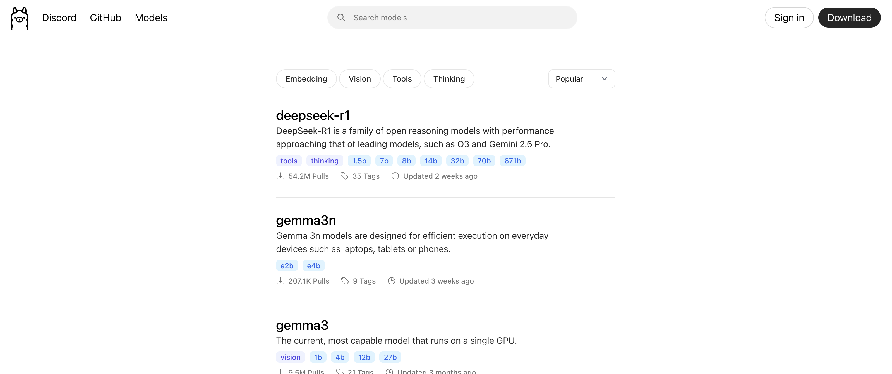
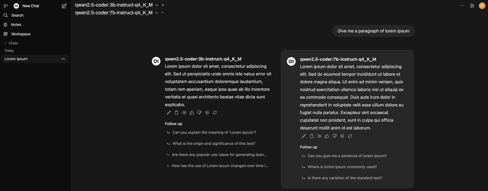

Fine! I'll have another look at AI. Geez.

At least, that's how it felt when I begrudgingly decided to look at running some models locally.

A few months ago, I decided to have a look at [vibe coding with Cursor](). Now, I'll have to admit that I went into that experiment fairly biased despite my best efforts to keep an open mind, but I walked away not very impressed and with the notion that AI was over-hyped even further cemented in my mind.

Given a few months and some more poking around with GitHub Copilot, and I think I'm ready to say that while I'm still quite bearish on AI in general, it has certainly found a place in my workflow. Unfortunately, I have experienced some frustration with it &mdash; largely along the lines of running out of Claude requests and being left with GPT, which would at times just seemingly disconnect and wouldn't return to working order until I restarted VS Code.

There's also the whole privacy concern. Personally I find myself unbothered by it, but in the context of customer data I am _very_ cautious about the implications.

Anyway, waking up with a "what do I want to look into today" landed me on the topic of running AI models locally.

## Getting started


Tip: Install with `brew install ollama` and then run `ollama` to see the available commands.


No surprises that I landed here. Even as someone who has had my head half-buried in the sand when it comes to AI, I was well aware of [Ollama](https://ollama.com/). A bit of light searching yielded alternatives, but I decided early on that I was just going to stick with the basics here.

Installation was a breeze, just needing a quick `brew install ollama` to install it locally. Once installed, calling `ollama` by itself shows us the relatively simple set of commands we can pass it, but to get started there's only a couple we really need.

First of all though, to start the Ollama server run `ollama serve`.

## Models

The basic commands we're after here are `ollama run`, `ollama list` and `ollama rm` to run a model, list all models, and remove models.

The Ollama [models page](https://ollama.com/search) details a slew of models that we can run.



Actually installing and running a model is as simple as calling `ollama run llama3.1`. This will download it if it hasn't yet been pulled, and runs it immediately. Once installed, we can start typing prompts into the terminal!

### Choosing a model

I'm not going to go too in-depth here &mdash; mostly because I still don't really understand it! I'll give it a red-hot crack anyway.

Looking at the list of available models, I saw a bunch of options and was completely lost as to which I needed. Looking at this heavily truncated list below, I was confused as to which I should use. Especially since there we easily 60+ variants to choose from!

- `llama3.1:405b-text-fp16`
- `llama3.1:70b-text-q3_K_S`
- `llama3.1:8b-instruct-q5_K_M`

Anyway, after a bit of reading I was able to break it down to the following, using `llama3.1:8b-instruct-q5_K_M` as a reference.

- `llama3.1` &mdash; the name of the model, each may be better or worse at some things.
- `8b` &mdash; the number of parameters the model contains. Roughly, the "size" of the model.
- `instruct` &mdash; the purpose of the model, which generally is the main function of that model.
- `q5_K_M` &mdash; the model's quantization, or roughly, level of optimisation.

The Ollama GitHub repository also provided this helpful note, providing some guidelines around system resource requirements for different model sizes.


You should have at least 8 GB of RAM available to run the 7B models, 16 GB to run the 13B models, and 32 GB to run the 33B models.


To expand slightly on quantization as that was a completely new term for me, quantization is the process of converting a model's weights from high precision data types to lower precision types. While this generally translates to a smaller resource footprint, it comes at the cost of a potential reduction in accuracy and quality.

Models can get even more complex than that, and I found [this page](https://developers.redhat.com/articles/2025/04/03/how-navigate-llm-model-names#) does a good job of explaining the terms without going too deep. In fact, it's just about where I pulled that little quantization explainer from.

Personally, I landed on the `qwen2.5-coder:3b-instruct-q4_K_M` and `qwen2.5-coder:7b-instruct-q4_K_M` models. The 3B model was nice and quick, and seemed to handle most basic tasks with ease. I did find myself frequently switching to the 7B model when the smaller one wasn't quite doing the job.

I also spent about half an hour looking at new PCs.

## Open WebUI

As nice as it is to be able to start running models locally with such ease, the interface leaves a little to be desired.

[Open WebUI](https://openwebui.com/) offers us a much nicer way to interact with our models &mdash; even allowing us to run multiple models side-by-side, which is perfect for comparing the output of various models.



Running the following should both pull and start the docker container. Note that this does also create a volume, so settings, chats, etc. will be persisted.

```shell
docker run -d -p 3000:8080 --add-host=host.docker.internal:host-gateway -v open-webui:/app/backend/data --name open-webui ghcr.io/open-webui/open-webui:main
```

## Performance

It didn't take long for a wry smile to grow on my face. I've spent long enough bragging about how well my decision to go with a MacBook Air has been, and after about a year and a half I finally ran into the thing that made me wish I had a little more grunt under the hood.

Even some of the smallest models were slow enough to be a little annoying, and those that didn't have smaller varieties were just slower than I would consider to be usable. Certainly, with no qualms about GPT harvesting my data, I was not about to pump the brakes on whatever thinking was going on under the hood.

I decided to flick open my dusty old Windows laptop (in fact it's neither dusty nor old, currently it serves as my game streaming server using [Sunlight](https://github.com/LizardByte/Sunshine)) and install Ollama there.

Woah. Okay, now we're running at what looked like 3-4x faster. Turns out having a GPU kinda helps.

## Ollama over the network

Cool. So we've got a fast-enough-to-be-usable machine running AI models. Unfortunately, I don't actually do any work on that laptop &mdash; it's pretty much dedicated to gaming\* these days. That said, I'd had a taste of how the models _should_ be running, and I couldn't look back.

_\* by which I mean, of course, the times I'd love to be playing games if life could just stop throwing me side quests_

I'm certainly no network buff, and I chose the path of least resistance. I quickly installed [ngrok](https://ngrok.com/) and exposed my Ollama endpoint (`http://localhost:11434`) to see if it was workable. Navigating to the endpoint that ngrok assigned for me, and I could see the very simple page that told me Ollama was running. Sweet!

Now, I really should clean this up &mdash; since I only intend to use this while I'm sitting within arm's reach of both laptops, I really could just serve this over my local network. For the sake of experimentation, however, that's tomorrow's problem.

### Open WebUI

I guess this one can come first since we've already talked about setting it up.

Since I already had this up and running on my MacBook, I just needed to pop into the settings. Under the option for **Connections** there is a section called **Manage Direct Connections**. This is where we can add the URL of our Ollama server.

With a bit of trial and error, I found that I needed to append the ngrok-provided URL with `/v1` to get it working. It should pick up the models automatically, although they can be specified explicitly if we want.

Alternatively, the likely easier way to achieve this would be to simply specify the `OLLAMA_BASE_URL` while we're creating the container, by adding `-e OLLAMA_BASE_URL=` to the previous command. Here's the command again, but you'll need to replace the URL with your own.

Note that this approach does **not** require us to append the URL with `v1`.

```shell
docker run -d -p 3000:8080 --add-host=host.docker.internal:host-gateway -e OLLAMA_BASE_URL=http://localhost:11434 -v open-webui:/app/backend/data --name open-webui ghcr.io/open-webui/open-webui:main
```

### GitHub Copilot

I was pretty stoked at this point, but GitHub Copilot was the big one.

I already knew Ollama was supported &mdash; in fact, hooking it up to Copilot was the first thing I did after running my first model. Wiring it up to Ollama running on a different computer proved to be a little less obvious, and fortunately I stumbled across a relevant [GitHub discussion](https://github.com/orgs/community/discussions/156483).

The TL;DR for the above is that we're looking for a setting called `github.copilot.chat.byok.ollamaEndpoint`. Throwing my ngrok endpoint at that setting allowed me to select the models running on my other machine.

The only annoyance I found with this is that I had two different sizes of the same model, and GitHub Copilot's interface just showed the same display name for each of them. As a workaround, it looks like I could possibly use a Modelfile to give my models better names, but that opened yet another door &mdash; and a welcome one at that.

## Modelfiles

Basically, one of the things I've disliked is this idea that I have a generic AI helper that I constantly need to keep feeding cues to. I have a coding style, and part of what has been turning me away from AI is that it won't write the code that I want it to write!

While, yes, in the context of GitHub Copilot, Cursor, etc., I can just throw a set of rules at it, I disliked the notion that I would need to maintain this on a per-project basis, constantly re-synchronising them with my other projects... Nope. That's not saving me time.

So, I started looking into custom models. Here's the [Modelfile reference](https://ollama.readthedocs.io/en/modelfile/#examples), which goes into a lot more detail than I have below.



```
FROM qwen2.5-coder:3b-instruct-q4_K_M

SYSTEM You are an expert in SvelteKit, the full-stack meta-framework. You are familiar with Svelte 5 syntax. You are familiar with the Svelte documentation found here: https://svelte.dev/docs/svelte/overview and the SvelteKit documentation found here: https://svelte.dev/docs/kit/introduction. When a question or instruction appears to be targeted towards a different web framework, make a suggestion to use a specialised model. Endeavour to answer questions as quickly as possible. Omit any examples or lengthy explanations unless requested.
```

I threw a couple of questions at it, and it answered as much as I expected it to.

```
>>> What do you specialise in?
I specialize in SvelteKit and related technologies, including Svelte 5 syntax, documentation from
svelte.dev/docs/svelte/overview, and the SvelteKit documentation at svelte.dev/docs/kit/introduction.

>>> Can you help me with a React project?
For React-related questions or assistance, I suggest using a model specialized in React development.
```

Knowing it was a Hail Mary at best, it unfortunately seemed to not be capable of looking up any information about the newer Svelte 5 syntax &mdash; which has thus far been a bit of a souring experience when it comes to using AI as a code assistant.

Additionally, if I asked it a more pointed question about React such as "can you show me an example React component", it would just spit out a component instead of telling me to use a model specific to React.

Honestly, not such a big deal, but I was kind of hoping to get a few models with a "soft" specialisation that I could feed additional context into with the hope of being able to just run a bunch of smaller, faster, targeted models that better fit the way I tend to use AI.

At the very least, we can tweak a few parameters and set the "tone" for the model's responses.

## Conclusion

It was pretty nice being able to get up and running as easily as it turned out to be. Given my laptop was churning out responses about as quickly as the network-bound GPT or Claude, I'm probably going to stick to running this locally for the time being, preserving my capped Claude requests for the truly difficult tasks.

I'm still curious about the potential for those smaller, targeted models, but a lot of the documentation I read about fine-tuning models just went straight over my head. I guess I'll settle for something more within my means, and just set up my Ollama server to run over my local network instead of through ngrok.

Now to convince my wife that I really do need that expensive PC upgrade...
