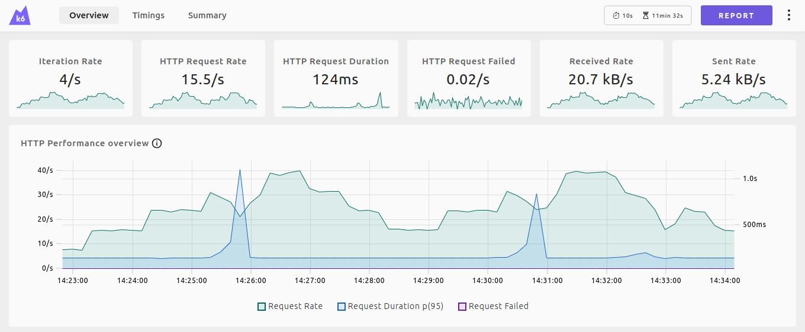

## Context

A client I have worked for previously often provided us with a list of requirements for any solution we built. One of those was around performance, quoting a target average response time of under 2 seconds for all requests. More often than not this was tested late into the project via some third-party scripts, leaving us with little time to resolve any issues.

Having previously needed to work on improving performance on an API we had built elsewhere, I was interested in learning how we might be able to enhance our workflow to ensure we could meet such constraints, and that any degradation was caught early and could be resolved or at the very least communicated to the client.

## Grafana k6

Straight from the opening blurb of [the website](https://grafana.com/docs/k6/latest/), k6 sounded like it would be the right tool for the job.

> Grafana k6 is an open-source, developer-friendly, and extensible load testing tool. k6 allows you to prevent performance issues and proactively improve reliability.

It landed on all of the features I needed and more, and the documentation is superb, clearly explaining all the features with plenty of [examples](https://grafana.com/docs/k6/latest/examples/). k6 also provides a list of [extensions](https://grafana.com/docs/k6/latest/extensions/) which looked pretty useful despite not finding myself needing any of them.

**Types of load tests**

The k6 documentation talks through the different supported [types of tests](https://grafana.com/docs/k6/latest/testing-guides/test-types/).

- [Smoke tests](https://grafana.com/docs/k6/latest/testing-guides/test-types/smoke-testing/) &mdash; minimal load
- [Average-load tests](https://grafana.com/docs/k6/latest/testing-guides/test-types/load-testing/) &mdash; normal conditions
- [Stress tests](https://grafana.com/docs/k6/latest/testing-guides/test-types/stress-testing/) &mdash; abnormal average
- [Soak tests](https://grafana.com/docs/k6/latest/testing-guides/test-types/soak-testing/) &mdash; reliability and performance over extended periods
- [Spike tests](https://grafana.com/docs/k6/latest/testing-guides/test-types/spike-testing/) &mdash; behavior and survival in cases of sudden increases in activity
- [Breakpoint tests](https://grafana.com/docs/k6/latest/testing-guides/test-types/breakpoint-testing/) &mdash; gradual increase to identify capacity limits

Given the context above, much of my focus here was around average-load tests, however it was pleasant to find that through k6's scenarios it would be quite trivial to switch between load test types.

## Getting started

Getting up and running with k6 was very straightforward. I'm using macOS, so the following commands might need to be adjusted for your system.

Install k6 with the following command.

```sh {linenos=false}
brew install k6
```

You can either create the file yourself or use the following to initialise a `script.js` file with some helpful commented-out code and explanations.

```sh {linenos=false}
k6 new
```



```js
import http from "k6/http";

export default function () {
  http.get("https://test.k6.io");
}
```

Run the tests!

```sh {linenos=false}
k6 run script.js
```

### Adding virtual users

The number of virtual users and duration can be set via the command line, or via an exported `options` in `script.js`.

```sh {linenos=false}
k6 run --vus 10 --duration 30s script.js
```



```js
import http from "k6/http";

export const options = {
  vus: 10,
  duration: "30s",
};

export default function () {
  http.get("https://test.k6.io");
}
```


The documentation covers some [fine-tuning for different operating systems](https://grafana.com/docs/k6/latest/set-up/fine-tune-os/). Using macOS I didn't run into any of the problems mentioned in the docs, however I did encounter a persistent "connection reset by peer" error when trying to use a high number of virtual users.

Running `sudo sysctl -w kern.ipc.somaxconn={DESIRED_VALUE}` with an increased value allowed me to run previously failing tests with far higher concurrent users.


### Adding typescript

Fortunately we do have access to some typings to allow us to use typescript while building our test file(s).

```sh {linenos=false}
npm init
npm install -D @types/k6
```

Which allows us to import and use types such as the following. Don't forget to rename the file to `*.ts`!



```ts
import { Options } from "k6/options";

export const options: Options = {
  vus: 10,
  duration: "30s",
};
```

At this point, attempting to run the tests will lead to an error. We need to use k6's experimental enhanced compatibility mode. This can be supplied as a flag via command line, or we can add an npm script to our newly-created `package.json`.



```json
"scripts": {
  "test": "k6 run script.ts --compatibility-mode=experimental_enhanced"
}
```

### Test output

There are multiple outputs when running tests with k6 which can be explored [here](https://grafana.com/docs/k6/latest/results-output/). The most useful of these I found was the web dashboard and generated HTML report, however there are also options to export a summary as CSV or JSON, or stream metrics to multiple services.

There is also an options to export a `handleSummary` function which can be used to customise the output of a test run.

**Web dashboard**

The bundled [web dashboard](https://grafana.com/docs/k6/latest/results-output/web-dashboard/) was very handy, and can also be used to [generate a report](https://grafana.com/docs/k6/latest/results-output/web-dashboard/#generate-html-test-reports).



To launch the dashboard, we simply need to set the `K6_WEB_DASHBOARD` environment variable to `true`. There are options to change the port and such, but for the sake of brevity we'll just use the defaults which will serve the dashboard at `http://localhost:5665`.

```sh {linenos=false}
K6_WEB_DASHBOARD=true k6 run script.js
```

Setting `K6_WEB_DASHBOARD_OPEN=true` will also cause the browser window to be opened automatically. From this page it is possible to save the report manually, although the likely more useful option &mdash; especially for CI/CD etc. is to simply tell k6 to output the report for us. Set `K6_WEB_DASHBOARD_EXPORT` to the name of the file you wish to output.

```sh {linenos=false}
K6_WEB_DASHBOARD=true K6_WEB_DASHBOARD_EXPORT="report.html" k6 run script.js
```

## Features

Below are some of the most prominent features. More information can be found in the [k6 documentation](https://grafana.com/docs/k6/latest/using-k6/).

### Options

[Options](https://grafana.com/docs/k6/latest/using-k6/k6-options/) can be provided to k6 via different means. Below is the priority order should multiple sources be provided. The more interesting thing to note is the ability to specify a `--config` flag which targets a file, allowing us to switch predefined options files easily.

- Default values
- Configuration file specified via the `--config` flag
- Script values
- Environment variables
- Command line flags

### Test lifecycle

k6 executes the test script in the following order.

- The optional `setup` function runs, setting up the test environment and generating data
- The required default or scenario function, running for as long and as many times as the options define
- The optional `teardown` function runs, cleaning up the test environment

Data created in the `setup` function can be accessed via a `data` parameter in the default and `teardown` functions.



```js
import http from "k6/http";

export function setup() {
  const res = http.get("https://httpbin.test.k6.io/get");
  return { data: res.json() };
}

export function teardown(data) {
  console.log(JSON.stringify(data));
}

export default function (data) {
  console.log(JSON.stringify(data));
}
```

### Scenarios

[Scenarios](https://grafana.com/docs/k6/latest/using-k6/scenarios/) give us the flexibility to mimic more realistic usage through more granular control over virtual users (VUs) and iteration scheduling patterns. Scenarios are defined in the `options` object, and can be used in place of the otherwise required `default` function.



```js
export const options = {
  scenarios: {
    shared_iter_scenario: {
      executor: "shared-iterations",
      vus: 10,
      iterations: 100,
      startTime: "0s",
    },
    per_vu_scenario: {
      executor: "per-vu-iterations",
      vus: 10,
      iterations: 10,
      startTime: "10s",
    },
  },
};

export default function () {
  http.get("https://test.k6.io/");
}
```

**Executors**

The VU workload for each scenario is scheduled by an [executor](https://grafana.com/docs/k6/latest/using-k6/scenarios/executors/), which configure how long the test runs for, and how workload is managed.

| Value                   | Description                                                               |
| ----------------------- | ------------------------------------------------------------------------- |
| `shared-iterations`     | Fixed iterations shared between VUs                                       |
| `per-vu-iterations`     | Each VU executes an exact number of iterations                            |
| `constant-vus`          | Fixed VUs execute as many iterations as possible for an amount of time    |
| `ramping-vus`           | Variable VUs execute as many iterations as possible for an amount of time |
| `constant-arrival-rate` | Fixed iterations are executed in a specified period of time               |
| `ramping-arrival-rate`  | Variable iterations are executed in a specified period of time            |

### Thresholds

[Thresholds](https://grafana.com/docs/k6/latest/using-k6/thresholds/) allow us to define parameters that we can measure [metrics](#metrics) against. Some examples of thresholds that can be defined are as follows. These can be incredibly useful in scenarios where we may want to either raise an alert against a live environment or fail a CI build. If any of the thresholds fail, k6 will exit with a non-zero exit code.

- Less than 1% of requests return an error
- 95% of requests have a response time below 200ms
- 99% of requests have a response time below 400ms
- A specific endpoint always responds within 300ms



```js
import http from "k6/http";

export const options = {
  thresholds: {
    http_req_failed: ["rate<0.01"], // http errors should be less than 1%
    http_req_duration: ["p(95)<200"], // 95% of requests should be below 200ms
  },
};

export default function () {
  http.get("https://test-api.k6.io/public/crocodiles/1/");
}
```

### Metrics

[Metrics](https://grafana.com/docs/k6/latest/using-k6/metrics/) measure how a system performs under test conditions. Metrics fall into four broad types:

- [Counters](https://grafana.com/docs/k6/latest/javascript-api/k6-metrics/counter/) &mdash; sum values
- [Gauges](https://grafana.com/docs/k6/latest/javascript-api/k6-metrics/gauge/) &mdash; track the smallest, largest, and latest values
- [Rates](https://grafana.com/docs/k6/latest/javascript-api/k6-metrics/rate/) &mdash; track how frequently a non-zero value occurs
- [Trends](https://grafana.com/docs/k6/latest/javascript-api/k6-metrics/trend/) &mdash; calculates statistics for multiple values (mean, mode or percentile)

**Built-in metrics**

k6 includes many [built-in metrics](https://grafana.com/docs/k6/latest/using-k6/metrics/reference/). The list is quite long, so it's worth a skim through to learn what data is being collected by default.

Example built-in metrics:

- `http_reqs` &mdash; total requests
- `http_req_failed` &mdash; error rate
- `http_req_duration` &mdash; request duration

**Custom metrics**

[Custom metrics](https://grafana.com/docs/k6/latest/using-k6/metrics/create-custom-metrics/) can be used to capture additional data points not covered by the built-in metrics. Below is an example of creating a custom metric.



```js
import http from "k6/http";
import { Trend } from "k6/metrics";

const myTrend = new Trend("waiting_time");

export default function () {
  const r = http.get("https://httpbin.test.k6.io");
  myTrend.add(r.timings.waiting);
  console.log(myTrend.name);
}
```

Which will output something similar to the below.

```diff {linenos=false}
iteration_duration.............: // omitted
iterations.....................: // omitted
waiting_time...................: avg=265.245396 min=265.245396 med=265.245396 max=265.245396 p(90)=265.245396 p(95)=265.245396
```

### Checks

Crossing more into the realm of functional testing, [checks](https://grafana.com/docs/k6/latest/using-k6/checks/) allow us to provide some assertions over the functionality of our tests. Failed checks do not directly result in a failed test, however they do produce metrics which can be combined with [thresholds](#thresholds).

While there is a lot of potential crossover with functional testing, checks may be worth considering as a way to ensure that our tests are actually testing the whole functionality of an endpoint. For example, should we have a long-running database query triggered by an endpoint, we may wish to ensure that the HTTP request is actually performing the database call. If the database doesn't exist, we may find that an error is returned very quickly and without a check we may assume that the query ran to completion in under our threshold.

### Categorisation

To help you visualize, sort, and filter your test results, k6 provides tags and groups as ways to categorise entities.

**Tags**

[Tags](https://grafana.com/docs/k6/latest/using-k6/tags-and-groups/#tags) quite simply allow us to categorise the following entities. Some of these tags are built-in and applied by default, however custom tags can easily be applied where required. It is also possible to tag an entire test, enabling comparing test results from across separate test runs.

- Requests
- Checks
- Thresholds
- Custom metrics

With tags applied, the output of our test run looks something like this.

```json
{
  "type ": "Point ",
  "data ": {
    "time ": "2017-05-09T14:34:45.239531499+02:00 ",
    "value ": 459.865729,
    "tags ": {
      "group ": "::my group::json ",
      "method ": "GET ",
      "status ": "200 ",
      "url ": "https://httpbin.test.k6.io/get "
    }
  },
  "metric ": "http_req_duration "
}
```

**Groups**

[Groups](https://grafana.com/docs/k6/latest/using-k6/tags-and-groups/#groups) allow us to organise a load script by functions. These can be nested, and the test output will have a tag called `group` with all wrapping group names.



```js
import { group } from "k6";

export default function () {
  group("visit product listing page", function () {
    // ...
  });
  group("add several products to the shopping cart", function () {
    // ...
  });
  group("visit login page", function () {
    // ...
  });
  group("authenticate", function () {
    // ...
  });
  group("checkout process", function () {
    // ...
  });
}
```

## Misc

k6 offers a collection of other [integrations and tools](https://grafana.com/docs/k6/latest/misc/integrations/), including links to examples or guides on things such as setting up a CI/CD pipeline with k6.

### OpenAPI integration

While probably not the most useful feature in practise, this may have some usefulness in very quickly setting up a test file as a starting point. [This article](https://k6.io/blog/load-testing-your-api-with-swagger-openapi-and-k6/) goes into more depth, but as a quick reference the following will generate a test script. However, the script itself will need to be cleaned up prior to being run.

Pull the container down.

```sh {linenos=false}
docker pull openapitools/openapi-generator-cli
```

Run the container, substituting the `-i` and `-o` flags for your respective input and output paths.

```sh {linenos=false}
docker run --rm -v "${PWD}:/local" openapitools/openapi-generator-cli generate \
    -i https://httpbin.test.k6.io/spec.json \
    -g k6 \
    -o /local/k6-test/ \
    --skip-validate-spec
```

**Generating swagger.json**

I was using a .NET Core API project, and to generate the `swagger.json` file the following steps were required.

```sh {linenos=false}
dotnet tool install swashbuckle.aspnetcore.cli
dotnet swagger tofile --output {OUTPUT_PATH} "{PATH_TO_PROJECT}/bin/Debug/net8.0/{PROJECT_NAME}.dll" v1
```

### Test authoring tools

While these looked promising I didn't look at either beyond reading the article, preferring to simply write the test scripts myself.

- [Test builder](https://grafana.com/docs/k6/latest/using-k6/test-authoring/test-builder/)
- [Browser recorder](https://grafana.com/docs/k6/latest/using-k6/test-authoring/create-tests-from-recordings/using-the-browser-recorder/)

### Sample repository

There is a very light sample repository available on [GitHub](https://github.com/vivecuervo7/k6-performance-testing) which includes a sample of the generated HTML report.
