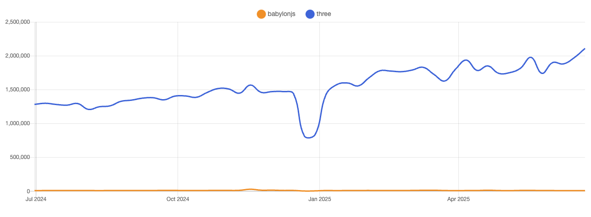
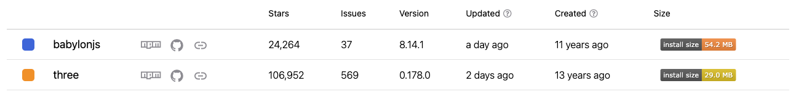

Recently I had cause to revisit the 3D web landscape. Having previously used [babylon.js](https://www.babylonjs.com/) for similar projects and having had a largely positive experience, I remained curious about how three.js stacked up against it.

I knew ahead of time that I was likely to land on a React app as a wrapper for any 3D content, and it was largely the presence of a couple of libraries that promised to make this a more streamlined experience &mdash; namely [react-three-fiber](https://r3f.docs.pmnd.rs/) and [drei](https://drei.docs.pmnd.rs/).

As such, this post will be leaning heavily on those, rather than looking at holding three.js directly.

## Yeah, but why?

While it has been a few years since I last worked with babylon.js, my initial memory of it was that it was big. Reviewing the landing page for it promises big things in the way of lighting, shadows, a Node Render Graph to control the whole render pipeline, right through to a fully-fledged physics engine.

Bottom line, it felt like a game engine. Which makes sense, as this is closer to what they're targeting.

Don't get me wrong &mdash; if I was building a more game-like experience, I would have jumped straight at babylon.js. My needs were a bit lighter however, which is what got me looking at the more lightweight three.js.

Additionally, looking at NPM trends for these two packages indicates that three.js is wildly more popular.



Although, I find that chart to be a little misleading. Babylon.js certainly isn't lacking in popularity &mdash; both libraries have plenty of stars on GitHub, and are kept up to date.



The bundle size is also worth a brief mention, although being modular this doesn't represent the final bundle size. But to give us a more concrete idea of what I mean by three.js being more lightweight, the minified and gzipped bundle size comes in at ~170kB, compared to babylon.js at 1.4MB.

What really sucked me however in was looking specifically at React Three Fiber and Drei. I was less swayed by the comparisons around bundle size and performance, as each seemed to have their own merits &mdash; three.js for smaller, lightweight cases, and babylon.js for the big guns. My use case was likely going to straddle the two, and when I find myself torn between two options in such cases, I tend towards that which offers a better developer experience.

## Simpler syntax with React Three Fiber

[This video](https://www.youtube.com/watch?v=DPl34H2ISsk&t=558s) does a great job of explaining what React Three Fiber (R3F) is actually doing under the hood, if you want a deeper explanation, but essentially it allows us to use a more React-like syntax when describing a three.js scene.



```ts
const scene = new Scene();

const cube = new Mesh();
cube.geometry = new BoxGeometry();
cube.material = new MeshStandardMaterial();

scene.add(cube);
```

Three.js will require us to explicitly create our mesh, add our geometry and materials, and then add it to the scene. From memory, this isn't far from what we'd expect in babylon.js either.

Down the track when we start looking to componentise things we're very likely to end up using classes, but realistically this is just plain old Javascript so we're pretty free in terms of how we want to split our code up.



```tsx
<mesh>
  <boxGeometry />
  <meshStandardMaterial />
</mesh>
```

Yep, straight up HTML-like markup.

R3F essentially works by saying that any child element will be added to it's parent with the `.add()` function. This is why we don't need to explicitly call `scene.add()` in R3F to have the object added to the scene.

The slight difference to be aware of here is that if a child element has an `attach` property, it will instead assign that child element to a _property_ of the parent.

There's a little magic in the example above, where R3F will automatically add the `attach` property to any elements that end with "Geometry" or "Material". This makes the above element equivalent to `<boxGeometry attach="geometry" />`, which assigns the `boxGeometry` element to the `geometry` property of `mesh`.

More importantly than the syntax changes themselves however, is that it means when we come to componentisation we can simply create standard React components.

## Drei

Drei provides a bunch of useful helpers and abstractions. I couldn't really imagine using R3F _without_ also bringing Drei to the table &mdash; although I did find it a little constraining in some cases, largely around cameras and camera controls.

That said, I don't know if this was specifically Drei, or it was more of an underlying problem.

## Performance

Interestingly, the only time I noticed any drop in performance was when some AI-generated slop (yeah, I wanted to quickly throw some decent functionality at three.js to make sure it could do what I wanted) caused excessive React renders.

From everything I've read online, three.js _should_ be capable to better performance by merit of being more lightweight and offering tooling a little closer to the metal than babylon.js. That said, the consensus seemed to be that babylon.js is going to provide more stable performance in larger or more complex scenes.

Babylon.js does seem to prefer ease-of-use, with documentation covering [how to optimise a scene](https://doc.babylonjs.com/features/featuresDeepDive/scene/optimize_your_scene#how-to-optimize-your-scene).

Ultimately, this wasn't going to be a deal-breaker for me, but it was interesting to note the difference in strengths between the two.

## Documentation

Now, this one took me by surprise. Three.js has been around for a bit longer, so I naturally assumed the documentation would be a strong point. Much to my surprise, the documentation wasn't lacking per se, but felt hard to consume. Perhaps it was due to using a few libraries, but I found myself constantly bouncing between three.js docs, R3F docs, and Drei docs.

Babylon.js on the other hand has _fantastic_ documentation. Where hunting for answers to problems in three.js took me down the path of forum posts and tutorials, the babylon.js documentation was all that was needed for the most part.

## Inspector

In a major point for babylon.js, three.js did not appear to have anything even remotely approaching the usefulness of babylon.js' [Inspector](https://doc.babylonjs.com/toolsAndResources/inspector). I don't recall using this extensively those few years ago, but it was useful on a couple of occasions. Certainly something I'd rather have and not need.

Three.js on the other hand did not offer anything similar. The closest I stumbled upon was a reference to some libraries that could help to display frame rates and draw calls etc. The easiest way to plug anything in was to use Drei's [`<Stats />`](https://drei.docs.pmnd.rs/misc/stats) component.

## XR support

This one came as no surprise, but babylon.js won out here. This was probably the moment where I started wondering whether babylon.js might still be my preferred option &mdash; it was just one of those things that I didn't want to have to mess around with to get working.

That said, it wasn't particularly difficult to get VR/AR working with three.js, but the first thing I noticed was a lack of typical VR controls such as being able to teleport around a scene.

## React integration

Relying quite heavily on some memories eroded by time, I have some vague recollection of integrating babylon.js with the React wrapper to be less than ideal. Workable, but it always felt like we were trying to bridge over the two worlds.

This is really the big reason why three.js and more specifically R3F jumped out at me. The React integration is really solid here, and makes it feel very easy to wrap React around a 3D experience. For a use case where the React-based UI would form a large part of the application, this felt like a solid argument for going with R3F.

### On-demand rendering

Ok, this one was pretty cool.

Three.js runs as you would expect a typical game or scene to run, where there is a game loop that causes constant re-renders. This is exactly what we want if we have a scene with constantly moving parts, but as was the case with what I needed, things very much could come to rest in between interactions.

R3F offers us the option for [on-demand rendering](https://r3f.docs.pmnd.rs/advanced/scaling-performance#on-demand-rendering), which allows us to set the canvas' `frameloop` prop, which means we will render frames whenever props are changed throughout the component tree. Adding this and watching the `<Stats />` panel showed that the FPS counter stopped dead in it's tracks whenever I wasn't directly interacting with the scene, and there was no discernable impact to the expected behaviour of the app once I started using it.

Yay for battery life, I guess?

### Concurrency

Without going into too much detail, R3F can lean on React's `useTransition` to defer heavy operations to maintain a stable framerate in demanding situations &mdash; something that vanilla three.js cannot achieve.

More info [here](https://r3f.docs.pmnd.rs/advanced/scaling-performance#enable-concurrency).

### State management

While it was really nice being able to let state flow through into the 3D parts of the application, it did mean that we needed to be keenly aware of how the different render cycles might impact one another. React, of course, has it's own way to manage when and where it should render things.

Where this rears it's head is when considering how things such as materials are instantiated. With our components being managed by the React, while we get some niceties such as automatic disposing of unused materials etc., we can easily fall into the trap of repeatedly instantiating objects. For example, even for a simple box, if every render means we're re-creating geometry and materials these will quickly add up.

Memoisation, shared materials etc., or instancing can help here. In contrast, babylon.js felt a little more simplified here from memory due to the in-engine code feeling quite divorced from the React wrapper.

While covered in the documentation's [performance pitfalls](https://r3f.docs.pmnd.rs/advanced/pitfalls) section, one that can easily be missed is that we also need to be careful about when we call `setState`.

`useFrame`, `useLoader`, [`GLTFJSX`](https://github.com/pmndrs/gltfjsx) are all things that are provided to help avoid these pitfalls, but coming from a React-heavy background these gotchas could easily be missed.

### Refs, refs everywhere

I think the first thing that made me a slight sense of unease with R3F was that so many things needed to be wired up with `useRef`. It's certainly not uncommon nor unexpected to need to access a bunch of the underlying objects. Maybe we want to toggle a material's visibility, or alter a mesh's position.

It quickly started to feel like a bit of ref hell, and while it was likely exacerbated by my willingness to let Copilot run away with its ideas (this was all part of the experiment), I quickly started losing track of all the refs flying around.

Not terrible, and probably the only way to handle many of these cases, but it just felt like it was making things a little harder to hold than they really needed to be.

## AI? AI.

Part of the experiment was seeing how Copilot held up to prompts. Now, I'm not about to become a [vibe coder](), but being realistic about the implications of AI in today's software development landscape I was curious to see if Copilot could hold R3F in a usable way.

I found Copilot to be quite usable, and this was without providing any custom instructions. Claude was unsurprisingly better than GPT, but I quickly ran out of free requests. I can imagine that with the appropriate hand-holding by way of global instructions etc., AI could be used as a significant accelerator to this kind of work &mdash; and as someone who does not have a strong foundation in 3D math, might actually help me get around some of those trickier 3D problems.

## Conclusion

Knowing that Babylon could absolutely tick all the boxes I needed it to, the question was largely whether three.js could achieve the same or similar outcome, with the answer being a resounding yes.

Honestly, that said I'm still not entirely sold on three.js. Even with the tidy React integration that R3F provides, I can't shake the feeling that it's really still aimed at small-to-medium sized use cases. I'm not sure what might be involved in implementing a custom camera controller, for example, but it just didn't feel like it would be quite so straightforward.

I think at the end of the day, I would probably consider whether the 3D scene was going to be simple or complex, and how much UI needed to be wrapped around it.

And then again, there's also [React Babylonjs](https://brianzinn.github.io/react-babylonjs/examples/index)...
