## What's the issue?

After working on a number of software projects, I have grown increasingly disenchanted with the amount of time spent ~arguing~ politely discussing the intricacies of a 3-point story compared to a 5-point story.

What's the difference between a 2-point story and a 3-point story? _Why_ is it different? Does such a trivial difference really matter?

I wanted to explore what a simplified model of estimations might look like, which more clearly conveys whether a thing is a typical piece of work, or whether it's bigger or smaller.

### Counting stories

While certainly not the norm, I've worked on _a_ project in the past where we simply treated every story as a single point.

Granted, it was a short, sharp project with a small team of two, and we didn't really have the time to get into debate over what each story point meant. This led to a pleasantly simple world, in which we just added stories and worried about finishing them.

Even with the short time frame, by the end of the project we were left with the reflection that there were a couple of stories that might have been better communicated as a larger task than the others, but overall the process worked for us.

### Fibonacci

The majority of projects I've been involved with to date have all used the Fibonacci sequence as our story point scale. I have never found this disagreeable, as it gives us a good idea of the relative complexity of our work items.

Typically, without poring through the entire backlog ahead of time we would aim to estimate the higher priority or more well-known work items, deferring estimation of the remainder until we got closer to them or the story was more fleshed out. As far as burn-up charts are concerned, all of the not-yet-estimated work items would simply reflect an average of the estimated backlog's points.

This works, and tends to work well.

It also takes time. Even on a smaller team, varying levels of experience with a technology will likely mean that one person's 3 might be another person's 5. On the lower end, if I've had a good week and I'm on a roll, those 3's start looking an awful lot like 2's.

Then there's a whole round of discussion required, digging through _why_ we're estimating the way we are, how it's justified based on last week's estimations, and then possibly another round of estimations. Granted, these discussions are often useful for uncovering some potential technical complexities, so they're not a total loss.

## Is there a middle ground?

After experiencing the two approaches outlined above, it wasn't hard to realise that much of the angst should be levelled at the **scale** we're using to estimate stories, rather than the estimation process as a whole. After all, we still need _something_ to communicate our progress to stakeholders, and we needed a way to assign those points.

And so, much of my thoughts started leaning into the idea that we could simplify things down to a typical user story, and using a smaller set of numbers to indicate whether the thing was bigger or smaller.

1, 2 and 3.

### How would this work?

Where the single-point approach was dead simple and just required adding a point for each story, the broader scale of the Fibonacci sequence meant that quite often we go into estimation without much of an idea of that story's complexity as far as points are concerned. We would run through the acceptance criteria and individually vote for where we think the story points should land, taking the majority number or discussing and re-estimating.

How I would envision a simpler scale to work would be that every story is by default a 2 at the moment estimation for that story begins. Thus, the question becomes "does anybody think this work item is significantly more or less complex than a typical work item?".

Based on the answer and ensuing discussion, it would either be changed to a 1 to represent a smaller or easier piece of work, and a 3 where the work was determined to be more complex.

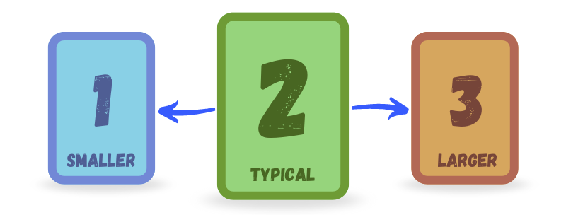

While not yet used in practice, this feels like a _much_ easier question to answer. And sure, there might still be disagreements &mdash; but it narrows down any discussion to only the stories which somebody has called out as easier or harder.

### A real-world analysis

After briefly talking over this idea with a couple of people, I decided it would be worth looking at some real-world data and seeing what a burn-up chart would look like if it were re-mapped to the simplified scale.

**Counts**

To do this, I essentially counted all of the completed work items and grouped them by their story points. Further consolidating them into groups of 'less than 3', 'between 3 and 8', and 'more than 8' gave me the most accurate simplified grouping.

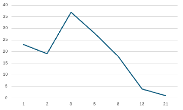 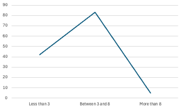

**Values**

Satisfied with the overlap between the original and simplified counts, I multiplied the counts by their respective story points and graphed those similarly &mdash; including what the numbers look like when re-mapped to the proposed 1-2-3 scale.

The resulting curve was fairly standard and further reinforced that the "typical" story worth the proposed 2 points would fairly cleanly overlap with what we would otherwise have estimated at between 3 and 8 points. The lack of resolution made it difficult to say whether or not this would pan out in practice, but things still lined up well enough to keep digging.

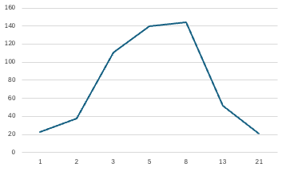 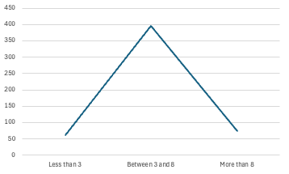 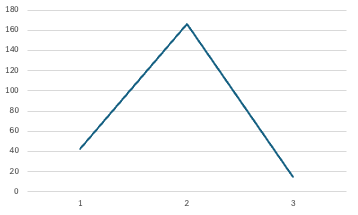

**Burn-up chart**

Looking to provide some more useful evidence, I also wanted to include the big thing that we use to communicate progress to our stakeholders &mdash; the burn-up chart.

A relatively simple experiment to set up, I took the previous mappings and filled in our usual burn-up data with the original values, and then compared them to what the curve would look like for the re-mapped values.

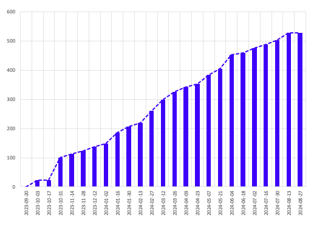 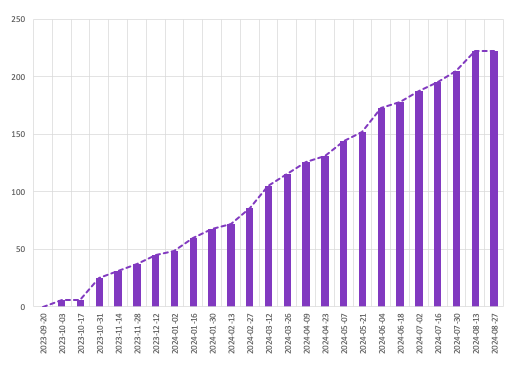

At a glance these look pretty similar, with the differences only really noticeable when overlaid on top of each other.

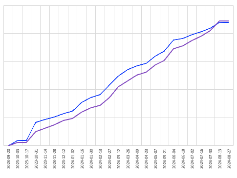

Where I _did_ notice a significant discrepancy was when looking at projections based on the preceding 5-week period. While the dotted projection line observed a like-for-like movement, the lower numbers in general led to a more dire forecast. I've included a projection based on the single-point method, and the re-mapped values are clearly a better middle ground.

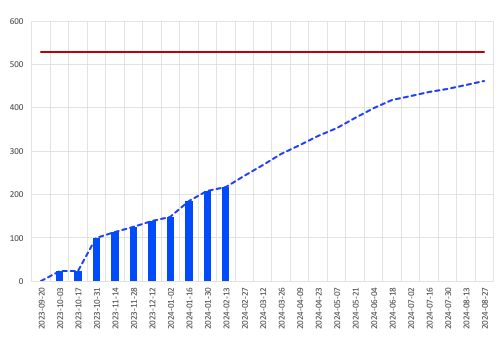 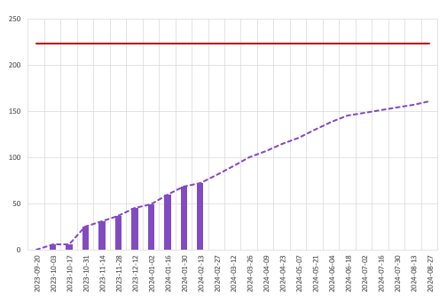 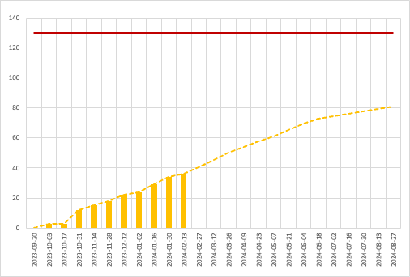

**Can the projection be fixed?**

Kind of. I did fiddle with the numbers a bit, and was able to find a model that mapped pretty well for _this_ project. The following changes gave me a significantly more accurate projection _and_ curve, but they came at the cost of simplicity.

- Changed the grouping to 'less than 3', 'between 3 and 5', and 'more than 5'
- Made the "bigger" value worth 5 points instead of 3

Most concerning was the required change to grouping. The change in complexity to move something either side of "typical" no longer felt balanced, and what would have likely been estimated as an 8 might still be left as a 2 under the proposed model, where for the more accurate projection it would need to have been moved to a 3.

Given the additional complexity and the original ideal of a process which alleviated much of the friction while maintaining better accuracy than the single-point method, I don't think it's worth trying to fiddle with the numbers here.

## Conclusion

There's a pretty big question sitting front and centre &mdash; would I use it?

I _think_ so. I'd like to compare burn-up charts for a couple of other projects &mdash; specifically the projections around the 30-40% mark. The other real-world backlog I had at my disposal was [similarly mapped](#projections-for-other-projects) and shows a better outlook for simplified approaches to estimation.

That said, I did also map the burn-up chart using the single-point-per-story method, and the projection discrepancy was even more pronounced &mdash; and I have seen this method used successfully, although the shorter engagement it was used for may have obscured any problems that might have arisen over a longer period.

### Projections for other projects

Another real-world project with their projections compared, with much more accurate projections than the first project. That said, the mapping for the single-point method looked pretty much on the money as well.

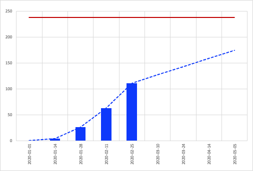 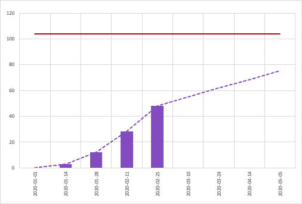 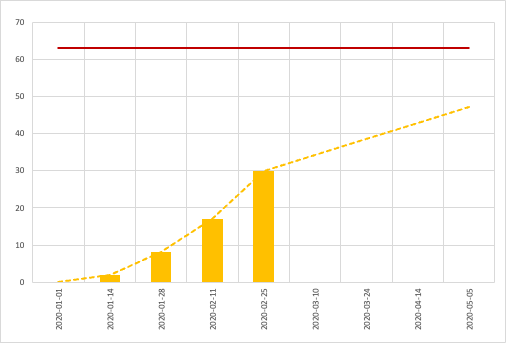
